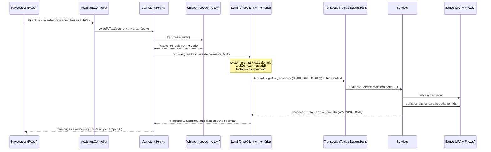

<div align="center">

# 💰 Controle Financeiro

### Conheça a **Lumi**, sua assistente de gastos por voz

**Fale quanto gastou. A Lumi registra no banco, vigia o seu orçamento e responde falando com você.**

[](https://github.com/BrunoBergamin/desafio-dio-spring-ai-budgeting/actions/workflows/ci.yml)
[](https://openjdk.org/projects/jdk/25/)
[](https://spring.io/projects/spring-boot)
[](https://docs.spring.io/spring-ai/reference/)
[](https://spring.io/projects/spring-security)
[](https://react.dev/)

[](https://maven.apache.org/)
[](https://flywaydb.org/)
[](#-rodando-com-um-comando-docker)
[](https://console.groq.com/)
[](https://platform.openai.com/docs/models)
[](https://www.mysql.com/)
[](https://www.h2database.com/)
[](https://springdoc.org/)
[](#-testes-automatizados)
[](https://www.dio.me/)
[](LICENSE)

[Rodar com Docker](#-rodando-com-um-comando-docker) · [WhatsApp](#-falando-com-a-lumi-pelo-whatsapp) · [Como usei IA](#-como-usei-ia-para-construir-o-projeto) · [Prints](#-a-aplicação-rodando) · [Fluxo](#-fluxo-principal) · [Arquitetura](#️-arquitetura) · [Decisões](#-decisões-de-arquitetura) · [Melhorias](#-o-que-evoluí-sobre-o-projeto-base) · [Rodar sem Docker](#️-rodando-sem-docker) · [Endpoints](#endpoints) · [Testes](#-testes-automatizados) · [O que aprendi](#-o-que-aprendi)

</div>

---

**Controle Financeiro** é um aplicativo de gastos pessoais em que você **fala** o que gastou ("gastei 80 reais no mercado") e a **Lumi**, a assistente de IA, entende, registra no banco, confere o seu orçamento do mês e responde em linguagem natural (em áudio, no perfil OpenAI). Também dá para perguntar ("quanto gastei este mês?", "e o de ontem?") e definir limites ("meu limite de mercado é 800").

Nasceu como entrega do **Desafio de Projeto DIO + Itaú**, evoluindo o projeto final do módulo [05-spring-ai](https://github.com/digitalinnovationone/dio-spring-boot-learning-track/tree/main/05-spring-ai) do expert Poiani, e cresceu até virar um projeto completo: **API com JWT e multiusuário, memória de conversa, orçamento com alertas, frontend React que grava a voz pelo navegador, atendimento pelo WhatsApp, migrations, CI e Docker**.

```
🎙️  você: "Gastei 85 reais no mercado hoje"
     ↓  transcrição (Whisper)
🤖  Lumi escolhe a ferramenta registrar_transacao  →  💾 banco  →  🎯 confere o orçamento
     ↓
🔊  Lumi: "Gasto registrado: oitenta e cinco reais no mercado hoje. Atenção, você já usou
           oitenta e cinco por cento do limite de mercado neste mês, restam quinze reais."
```

> **Tudo aqui foi rodado de verdade e sem pagar nada**, na camada gratuita da [Groq](https://console.groq.com). Os prints e as respostas deste README são reais, não exemplos inventados.

> 💸 **Custo para rodar: zero.** A IA (chat e transcrição de áudio) usa o plano gratuito da Groq, que tem um limite diário de requisições e tokens mais do que suficiente para uso pessoal, sem cartão de crédito. O WhatsApp usa a [Evolution API](https://github.com/EvolutionAPI/evolution-api), que é open source e roda no seu computador dentro do `docker compose`, sem mensalidade. Banco (H2 ou MySQL), Docker, GitHub Actions: tudo gratuito. A única coisa paga é opcional: a resposta em áudio (text-to-speech) do perfil OpenAI, que a aplicação desliga sozinha quando a chave não existe.

---

## ✅ O que a entrega cobre

| O que o desafio pede | Resposta curta | Onde ver |
|---|---|---|
| **O que o projeto faz** | Recebe comando de voz ou texto; a Lumi entende a intenção, executa uma função real (Tool Calling), grava ou consulta no banco e responde. | [Fluxo](#-fluxo-principal) |
| **Como executar** | `docker compose up --build` (um comando) ou `./mvnw spring-boot:run`. Sem instalar nada além do Docker. | [Rodar](#-rodando-com-um-comando-docker) |
| **Qual melhoria implementei** | 24 evoluções sobre o projeto base, de validação no caminho da IA até WhatsApp, frontend e modo demo sem senha. | [Melhorias](#-o-que-evoluí-sobre-o-projeto-base) |
| **Tecnologias** | Java 25, Spring Boot 4.1, Spring AI 2.0, Spring Security 7, JPA + Flyway, React 19, Docker, GitHub Actions. | [Tecnologias](#️-tecnologias) |
| **Como testar o fluxo principal** | Pelo navegador (botão do microfone), pelo Swagger ou por `curl`, com áudios de exemplo no repositório. | [Como testar](#-como-testar-o-fluxo-principal) |
| **O que aprendi** | Dezessete lições, incluindo dois bugs de biblioteca que precisei contornar. | [O que aprendi](#-o-que-aprendi) |

---

## 🐳 Rodando com um comando (Docker)

Precisa só do [Docker](https://www.docker.com/products/docker-desktop/). Não precisa de Java, Maven nem Node: tudo é compilado dentro da imagem.

```bash
git clone https://github.com/BrunoBergamin/desafio-dio-spring-ai-budgeting.git
cd desafio-dio-spring-ai-budgeting
cp .env.example .env        # preencha GROQ_API_KEY (grátis) e APP_JWT_SECRET
docker compose up --build
```

Abra **http://localhost:8080** e fale com a Lumi. **Não precisa criar conta nem senha**: o site entra sozinho na conta de demonstração, que já vem com dois meses de gastos fictícios e quatro orçamentos. O Swagger fica em `/swagger-ui.html` e o health check em `/actuator/health`.

> **Modo demonstração (padrão).** A conta `demo@lumi.local` (senha fictícia `lumi-demo-1234`, só existe no seu computador) é criada na primeira subida com 30 lançamentos e 4 limites, e o frontend pega o token em `POST /api/auth/demo`. Quem for testar (recrutador, professor, você no celular) abre a URL e já vê o painel cheio. Para usar de verdade, com cadastro e login normais, coloque `APP_DEMO_ENABLED=false` no `.env`: o JWT, o multiusuário e o isolamento por usuário continuam lá, só ficam escondidos na demonstração.

- A chave da Groq é gratuita: crie em https://console.groq.com/keys (sem cartão).
- Quer MySQL em vez do H2 em memória? `SPRING_PROFILES_ACTIVE=groq,mysql` no `.env` e `docker compose --profile mysql up --build`.
- A imagem final roda como usuário sem privilégio (`lumi`), tem `HEALTHCHECK` e pesa ~800 MB (JRE 25 + Ubuntu; um `alpine` reduziria, mas priorizei previsibilidade).

---

## 💬 Falando com a Lumi pelo WhatsApp

A mesma Lumi atende pelo WhatsApp: você manda um áudio ou um texto e ela registra o gasto, avisa do orçamento e responde por lá. A integração usa a [Evolution API](https://github.com/EvolutionAPI/evolution-api) (perfil `whatsapp`), que roda **junto no `docker compose`**: a Evolution chama a aplicação pela rede interna, então **não precisa de ngrok nem de servidor público**.

```bash
# .env: SPRING_PROFILES_ACTIVE=groq,whatsapp  +  EVOLUTION_API_KEY  +  WHATSAPP_WEBHOOK_SECRET
docker compose --profile whatsapp up --build
```

1. Abra a página **WhatsApp** do site, clique em **Gerar QR code** e escaneie com o seu celular (WhatsApp → Aparelhos conectados).
2. No WhatsApp, abra o chat **"Você"** (mensagem para mim mesmo) e mande "gastei 30 reais na farmácia", em texto ou áudio. A Lumi responde ali mesmo.
3. No modo demo não precisa vincular nada: a primeira mensagem que você manda para si mesmo liga o número pareado à conta de demonstração. Com o modo demo desligado, vincule o número na própria página WhatsApp.

Foi pensado para o seu WhatsApp pessoal: a Lumi só age no chat com você mesmo. O que você manda para outras pessoas, e o que elas mandam para você, é ignorado em silêncio. (Com um chip exclusivo da Lumi, `WHATSAPP_REPLY_UNKNOWN=true` faz ela responder a desconhecidos com um convite para se cadastrar.)

Testado no meu próprio WhatsApp, no chat "Você", só com áudio. Três notas de voz e três respostas da Lumi: registrou os cinquenta reais da farmácia, resumiu o mês (dados fictícios da conta demo) e, quando pedi ideias de economia, usou os números reais das categorias (restaurantes, assinaturas, lazer) em vez de dar conselho genérico:

<p align="center"></p>

<details>
<summary><b>Página WhatsApp do site: parear pelo QR code (clique para ver)</b></summary>


</details>

Como funciona por dentro: `POST /api/whatsapp/webhook/{segredo}` recebe o evento `messages.upsert`, responde `202` na hora e processa em segundo plano (`@Async`); o áudio chega em base64 (`ogg/opus`, aceito direto pelo Whisper); o número vira o usuário pela tabela `users.phone`; a resposta volta por `POST /message/sendText` (e em áudio, no perfil OpenAI). No chat "Você" a própria resposta da Lumi volta pelo webhook como se fosse sua: a aplicação guarda os ids do que enviou e ignora o eco, senão ela conversaria consigo mesma para sempre. A conversa do WhatsApp tem memória própria, separada da do site. O provedor fica atrás da interface `WhatsAppGateway`: trocar a Evolution pela **API oficial da Meta** é escrever outra implementação, e mais nada.

> **Escolha consciente:** a Evolution não é a API oficial (usa o WhatsApp Web por baixo) e a Meta pode bloquear o número. Para demonstração e portfólio ela é imbatível: grátis, local, sem cadastro de empresa. Para produção, a implementação oficial entra no lugar sem mexer no resto.

---

## 📸 A aplicação rodando

**Painel**: gasto do mês com comparação ao mês anterior, maior categoria, orçamentos, gráfico por categoria e por dia, últimos lançamentos. Navegação por mês, tema escuro e claro.


**Conversa com a Lumi**: microfone, upload de arquivo de áudio (inclusive as notas de voz `.ogg` do WhatsApp, arrastando para a tela), histórico guardado no navegador, horário em cada mensagem. Abaixo, uma frase com dois gastos e uma nota de voz enviada como arquivo:


<details>
<summary><b>Tema escuro, celular, gastos e login (clique para ver)</b></summary>


</details>

<details>
<summary><b>Gravando pela voz no navegador (clique para ver)</b></summary>

O botão do microfone usa `MediaRecorder` e grava em `webm/opus`, formato aceito pelo Whisper. Abaixo, a transcrição da minha voz e a resposta com dados reais do banco:


</details>

<details>
<summary><b>Swagger e os primeiros testes com a minha voz (clique para ver)</b></summary>


Os dois áudios estão em [`docs/audio`](docs/audio): me apresentando (ela entendeu que não havia gasto e **não inventou nada**) e perguntando o total do mês (ela buscou no banco em vez de chutar).


</details>

---

## 🔄 Fluxo principal



1. O navegador grava o áudio e envia com o token JWT.
2. O áudio vira texto (`TranscriptionModel`).
3. A Lumi (`ChatClient` com `MessageChatMemoryAdvisor`) entende a intenção e escolhe uma **ferramenta** (Tool Calling).
4. A ferramenta recebe o usuário pelo **`ToolContext`** (o modelo nunca vê nem escolhe o usuário) e delega ao service.
5. O service valida, grava e confere o orçamento da categoria; o alerta volta no resultado da própria ferramenta.
6. A Lumi responde em uma frase curta; no perfil OpenAI, a frase vira MP3 (`TextToSpeechModel`).

---

## 🏗️ Arquitetura

```
src/main/java/dio/budgeting
├── controller/   AuthController, TransactionController, BudgetController, AssistantController  (prefixo /api)
├── service/      AuthService, TransactionService, BudgetService, ExpenseService, AssistantService, LumiChat
├── tool/         TransactionTools, BudgetTools, ToolUser   (@Tool: adaptadores entre a IA e os services)
├── security/     JwtService, CurrentUserProvider, AppUserDetailsService, ProblemDetailResponses
├── repository/   UserRepository, TransactionRepository, BudgetRepository  (toda consulta filtra por usuário)
├── entity/       User, Transaction, Budget, Category, BudgetStatus
├── dto/          request/ e response/ (a entity nunca sai da API)
├── mapper/       Entity ⇄ DTO
├── exception/    exceções de negócio + GlobalExceptionHandler (ProblemDetail / RFC 9457)
├── config/       SecurityConfig, JwtConfig, ChatClientConfig, OpenApiConfig, WebMvcConfig
└── web/          SpaForwardController (entrega o React nas rotas da SPA)

src/main/resources/db/migration   V1 transações · V2 usuários · V3 orçamentos  (Flyway)
frontend/                          React 19 + Vite + TypeScript (gravação de voz, gráfico, orçamentos)
.github/workflows/ci.yml           backend (mvnw verify) · frontend (tsc + build) · imagem Docker
```

**A regra que sustenta tudo:** o controller não conhece o repository, a IA nunca toca no banco, e **REST e Lumi passam pelo mesmo service com as mesmas regras**. O `userId` é o primeiro parâmetro de todo método de service, sem sobrecarga sem ele: esquecer o usuário não compila.

---

## 🧠 Decisões de arquitetura

As três que mais valem uma conversa de entrevista:

**1. O usuário chega à ferramenta pelo `ToolContext`, não pelo `SecurityContext`.**
O Spring AI injeta um parâmetro `ToolContext` no método `@Tool` e **o exclui do JSON Schema** enviado ao modelo. Logo a IA não vê, não descreve e não consegue preencher o `userId`. Há um teste que manda um `userId` falso nos argumentos da ferramenta e prova que ele é ignorado (`TransactionToolsTest.should_ignoreUserIdSentByTheModel`). O `SecurityContextHolder` até funciona hoje, porque o `ToolCallingAdvisor.adviseCall` é síncrono, mas trocar `.call()` por `.stream()` moveria a execução para outra thread e o `ThreadLocal` sumiria em silêncio. Defesa em quatro camadas: schema, assinatura do service, filtro no repositório e `ToolUser.require`, que explode se o contexto vier vazio.

**2. A memória de conversa fica fora do loop de ferramentas.**
O `MessageChatMemoryAdvisor` (ordem `MIN+200`) roda antes do `ToolCallingAdvisor` (`MIN+300`), então o histórico guarda só o par pergunta/resposta, e não as idas e vindas das ferramentas. Isso segura o custo em tokens. A chave da memória é sempre `userId:conversa`, derivada do JWT: mandar o mesmo `conversationId` de outra pessoa não lê nada dela. Memória em RAM com janela de 10 mensagens, escolha consciente: some no restart e não funciona com várias instâncias, e está documentado. Como o id da conversa vem do cliente, a janela sozinha não bastaria: um `BoundedChatMemoryRepository` (Decorator sobre o repositório do Spring AI) guarda no máximo 200 conversas e descarta a parada há mais tempo (LRU).

**3. O alerta de orçamento é determinístico, não depende do modelo lembrar.**
Em vez de esperar que a IA chame uma segunda ferramenta, a própria `registrar_transacao` devolve a transação **e** o status do orçamento. O modelo recebe o alerta no resultado e comenta naturalmente, sem round-trip extra. Os limiares (80% / 100%) são calculados com os valores exatos, não com o percentual arredondado: `399,99 de 500` ainda é OK. Um teste de fronteira pegou esse bug antes de virar produto.

Outras decisões: `VARCHAR(36)` e `TIMESTAMP(6)` nas migrations para o **mesmo SQL** servir H2 e MySQL (`DATETIME` não existe no H2 2.x; UUID nativo vira `BINARY(16)` no MySQL); JWT com o suporte nativo do Spring Security (`NimbusJwtEncoder`, HS256) em vez de biblioteca extra; 401/403 escritos como `ProblemDetail` por um `AuthenticationEntryPoint` próprio, porque exceções de segurança acontecem antes do `@RestControllerAdvice`; frontend empacotado dentro do jar para **uma porta, sem CORS, um container**; token no `localStorage` com o trade-off (XSS) documentado, cookie `HttpOnly` seria o próximo passo.

**Memória da JVM sob controle.** Tudo que fica em RAM tem teto: conversas (200, LRU), mensagens por conversa (10), ids de mensagens enviadas ao WhatsApp (500, LRU), áudio de upload (10 MB, `MultipartFile`), lista que a ferramenta devolve ao modelo (50 lançamentos; para totais existe `resumo_de_gastos`, que agrega no banco). O webhook do WhatsApp roda em **threads virtuais** (Java 21+, `spring.threads.virtual.enabled`) com limite de 8 em paralelo, que dá backpressure em vez de fila infinita; o pool do Hikari tem 5 conexões; no Docker o container tem `mem_limit: 640m` e a JVM lê esse teto (`MaxRAMPercentage=75`, `ExitOnOutOfMemoryError` para cair e subir de novo em vez de virar zumbi). No navegador, os blobs de áudio da conversa são liberados com `URL.revokeObjectURL` ao sair da página.

**Padrões de projeto que aparecem no código**, sem inventar camada nova: *Ports and Adapters* na integração com o WhatsApp (`WhatsAppGateway` é a porta, `EvolutionApiGateway` o adaptador; a API oficial da Meta entraria como outro adaptador); *Decorator* no `BoundedChatMemoryRepository`; *Facade* no `AssistantService`, que esconde transcrição, chat e voz atrás de três métodos; *Command* no Tool Calling (cada `@Tool` é um comando que o modelo escolhe e o Spring AI executa); *Repository* e *DTO + Mapper* nas bordas do banco e da API; *Null Object* implícito no text-to-speech opcional (`ObjectProvider` + `Optional`, sem `if` de perfil espalhado); *Strategy* de configuração por perfil (Groq, OpenAI, MySQL, WhatsApp) em vez de `if` no código.

---

## 🚀 O que evoluí sobre o projeto base

| # | Melhoria | Onde |
|---|----------|------|
| 1 | **Reorganização em camadas clássicas** (controller, service, repository, entity, dto, mapper, exception, config, tool, security, web). | todo o projeto |
| 2 | **Validações antes de salvar** (valor, descrição, categoria, data futura), reaplicadas no service porque a ferramenta da IA não passa pelo `@Valid` do controller. | `TransactionService`, `BudgetService` |
| 3 | **Bug de centavos corrigido**: o base mostrava 80 reais como `8000.0`. Valores em `BigDecimal`. | `Transaction` |
| 4 | **Login e multiusuário com JWT** (Spring Security 7): cada pessoa só vê os próprios gastos; transação alheia responde 404, não 403. | `SecurityConfig`, `AuthService`, `JwtService` |
| 5 | **Escopo do usuário no Tool Calling via `ToolContext`**, com teste adversarial. | `ToolUser`, `TransactionTools` |
| 6 | **Memória de conversa** (`MessageWindowChatMemory`): "e o de ontem?" funciona; chave por usuário; `DELETE /api/assistant/conversation`. | `LumiChat`, `ConversationKey` |
| 7 | **Orçamento mensal por categoria com alertas** (OK / atenção / estourado) e 4 ferramentas novas para a Lumi. | `BudgetService`, `BudgetTools` |
| 8 | **Alerta entregue junto do registro do gasto**, sem round-trip extra ao modelo. | `ExpenseService` |
| 9 | **Migrations com Flyway** (4 versões, SQL portátil H2/MySQL) e `ddl-auto=validate`; os testes de repositório rodam sobre as migrations. | `db/migration`, `@JpaTest` |
| 10 | **Frontend React 19 + Vite + TypeScript**: painel com indicadores e dois gráficos, chat com microfone, upload e arrastar-e-soltar de áudio (aceita as notas de voz do WhatsApp), histórico persistente, tema claro/escuro, notificações, edição inline de gastos e orçamentos, navegação por mês, layout de celular com menu inferior. Dados com React Query (cache e invalidação), 10 testes com Vitest + Testing Library. | `frontend/`, `SpaForwardController` |
| 11 | **Docker em 3 estágios** (Node → Maven → JRE), usuário não-root, `HEALTHCHECK`, `compose` com MySQL opcional. | `Dockerfile`, `compose.yml` |
| 12 | **CI no GitHub Actions**: backend, frontend e imagem Docker, verde sem nenhum segredo. | `.github/workflows/ci.yml` |
| 13 | **Actuator** (`health`, `info`, `metrics`) e prefixo `/api` em todos os endpoints. | `WebMvcConfig`, `application.properties` |
| 14 | **Perfil gratuito (`groq`)**: mesma aplicação, só configuração; text-to-speech opcional (503 explicado). | `application-groq.properties` |
| 15 | **Contorno de bug aberto do Spring AI** (`reasoning_content` reenviado à Groq, [issue #6968](https://github.com/spring-projects/spring-ai/issues/6968)). | `application-groq.properties` |
| 16 | **Conflito de versão do Swagger** (Spring AI × springdoc) resolvido no `pom.xml`, com o porquê. | `pom.xml` |
| 17 | **Áudio em formato inesperado vira 422 explicado** (o Gravador do Windows salva AAC cru como `.m4a`). Descoberto testando com a minha voz. | `AssistantService` |
| 18 | **Erros padronizados** com `ProblemDetail` em toda a API, inclusive 401/403 da camada de segurança. | `GlobalExceptionHandler`, `ProblemDetailResponses` |
| 19 | **System prompt** com data de hoje, proibição de inventar valores, memória e orçamento; persona "Lumi". | `prompts/system-message.st` |
| 20 | **119 testes** (unitários, `@WebMvcTest` com segurança real, `@DataJpaTest` com Flyway, ponta a ponta com IA). | `src/test` |
| 21 | **WhatsApp via Evolution API** (perfil `whatsapp`): webhook protegido por segredo, vínculo número → conta, áudio e texto, resposta em segundo plano, provedor atrás de interface. | `whatsapp/`, `WhatsAppController` |
| 22 | **16 categorias** (mercado, restaurante, saúde, moradia, transporte, carro, assinaturas, roupas, beleza, lazer, educação, pets, viagem, presentes, impostos, outros) com um guia no schema da ferramenta para o modelo classificar melhor. Sem migration: a coluna já era texto. | `Category` |
| 23 | **Modo demonstração**: conta pronta com dois meses de gastos e orçamentos, login automático sem senha, número do WhatsApp vinculado na primeira mensagem. `APP_DEMO_ENABLED=false` volta ao cadastro normal. | `demo/`, `AuthContext.tsx` |
| 24 | **Memória sob controle**: conversas limitadas (Decorator LRU), threads virtuais com limite de paralelismo, lista da ferramenta com teto, `mem_limit` no compose e JVM que respeita o container. | `BoundedChatMemoryRepository`, `application.properties`, `compose.yml` |

---

## 🛠️ Tecnologias

- **Java 25** · **Spring Boot 4.1** (Web, Validation, Data JPA, Actuator, Security, OAuth2 Resource Server)
- **Spring AI 2.0**: `ChatClient`, Tool Calling (`@Tool` + `ToolContext`), `MessageChatMemoryAdvisor`, `TranscriptionModel`, `TextToSpeechModel`
  - **Groq** (perfil `groq`, gratuito): `openai/gpt-oss-120b` + `whisper-large-v3-turbo`
  - **OpenAI** (perfil padrão): `gpt-4o-mini` + `whisper-1` + `gpt-4o-mini-tts`
- **Flyway 12** · **H2** (padrão) e **MySQL 9** · **Lombok** · **springdoc-openapi**
- **React 19**, **Vite 8**, **TypeScript**, `react-router`, `@tanstack/react-query`, `axios`, `recharts`, CSS puro com variáveis (tema claro/escuro)
- **Vitest + Testing Library** no frontend
- **JUnit 5, Mockito, MockMvc, Spring Security Test, AssertJ**
- **Maven** (wrapper) · **Docker** · **GitHub Actions**

---

## ▶️ Rodando sem Docker

Pré-requisitos: JDK 25 e (só para o frontend em modo dev) Node 22.

```bash
cp .env.example .env            # GROQ_API_KEY + APP_JWT_SECRET
./mvnw spring-boot:run -Dspring-boot.run.profiles=groq     # API em :8080 (Windows: .\mvnw.cmd ...)
```

Frontend com hot reload (o Vite faz proxy de `/api` para a API, sem CORS):

```bash
cd frontend && npm install && npm run dev                  # http://localhost:5173
```

Para servir o React pela própria API (como no Docker): `npm run build`, copie `frontend/dist` para `src/main/resources/static` e empacote com `./mvnw package`.

| O quê | URL |
|------|-----|
| Aplicação | http://localhost:8080 (ou :5173 em dev) |
| Swagger UI | http://localhost:8080/swagger-ui.html: botão **Authorize** com o token do `/api/auth/demo` (sem senha) ou do `/api/auth/login` |
| Health | http://localhost:8080/actuator/health |
| Console H2 | http://localhost:8080/h2-console (`jdbc:h2:mem:budgeting`, usuário `sa`) |

Perfil OpenAI (com áudio de resposta em MP3): defina `OPENAI_API_KEY` e rode sem `-Dspring-boot.run.profiles`. Perfil MySQL local: `-Dspring-boot.run.profiles=groq,mysql` (o Spring sobe o `compose.yml` do banco sozinho).

---

## 🧪 Como testar o fluxo principal

**Pelo navegador (mais fácil):** abra http://localhost:8080 (já entra na conta demo), clique no microfone, fale *"gastei 45 reais na farmácia"* e veja a transação aparecer no gráfico. Depois pergunte *"quanto gastei este mês?"*.

**Pelo Swagger:** `POST /api/auth/demo` (ou `/register`) → copie o `token` → botão **Authorize** → `POST /api/assistant/voice/text` com um dos áudios de `src/test/resources/audio`.

**Por `curl`** (o arquivo [`requests.http`](requests.http) tem tudo pronto para o IntelliJ/VS Code):

```bash
# 1. token da conta demo (sem senha). Com APP_DEMO_ENABLED=false, use /api/auth/register
TOKEN=$(curl -s -X POST localhost:8080/api/auth/demo | jq -r .token)

# 2. limite do mês
curl -s -X POST localhost:8080/api/budgets -H "Authorization: Bearer $TOKEN" -H "Content-Type: application/json" \
  -d '{"category":"GROCERIES","monthlyLimit":100}'

# 3. voz -> texto (resposta real abaixo)
curl -s -X POST localhost:8080/api/assistant/voice/text -H "Authorization: Bearer $TOKEN" \
  -F "file=@src/test/resources/audio/recording-1.m4a"

# 4. voz -> MP3 (perfil OpenAI)
curl -s -X POST localhost:8080/api/assistant/voice -H "Authorization: Bearer $TOKEN" \
  -F "file=@src/test/resources/audio/recording-1.m4a" --output resposta.mp3
```

Resposta real do passo 3 (o texto varia conforme o modelo):
```json
{
  "transcription": "Passei na farmácia rapidinho e deixei 80 reais em 3 itens.",
  "answer": "Gasto de oitenta reais registrado na farmácia para hoje.",
  "conversationId": "default"
}
```

> **Dica:** se gravar com o Gravador de Voz do Windows, o `.m4a` pode vir como AAC cru e a API responde `422` explicando. Converta com `ffmpeg -i gravacao.m4a gravacao.mp3`. Pelo navegador isso não acontece: o `MediaRecorder` grava em `webm`, aceito direto.

### Endpoints

| Método | Rota | Descrição |
|-------|------|-----------|
| POST | `/api/auth/demo` | Token da conta de demonstração, sem senha (público; 404 com o modo demo desligado) |
| POST | `/api/auth/register` · `/api/auth/login` | Conta e token JWT (público) |
| GET | `/api/auth/me` | Usuário autenticado |
| POST/GET | `/api/transactions` | Registra · lista (`?category=&start=&end=`) |
| GET | `/api/transactions/summary` | Total e percentual por categoria (padrão: mês atual) |
| GET/PUT/DELETE | `/api/transactions/{id}` | Busca · atualiza · remove (só do próprio usuário) |
| POST/GET | `/api/budgets` | Define · lista limites do mês com quanto já foi gasto |
| GET | `/api/budgets/alerts` | Só as categorias em atenção ou estouradas |
| PUT/DELETE | `/api/budgets/{id}` | Altera limite · remove |
| POST | `/api/assistant/chat` | Comando em texto (`conversationId` opcional) |
| POST | `/api/assistant/voice/text` | Áudio → transcrição + resposta JSON |
| POST | `/api/assistant/voice` | Áudio → resposta MP3 (503 no perfil groq) |
| DELETE | `/api/assistant/conversation` | Apaga o histórico da conversa |
| PUT | `/api/auth/me/phone` | Vincula o número do WhatsApp à conta |
| GET/POST | `/api/whatsapp/status` · `/api/whatsapp/connect` | Estado da conexão · QR code para parear (perfil `whatsapp`) |
| POST | `/api/whatsapp/webhook/{segredo}` | Chamado pela Evolution a cada mensagem (público, protegido pelo segredo) |

Categorias: `GROCERIES`, `RESTAURANT`, `PHARMA`, `HOUSING`, `TRANSPORT`, `AUTO`, `SUBSCRIPTIONS`, `CLOTHING`, `PERSONAL_CARE`, `LEISURE`, `EDUCATION`, `PETS`, `TRAVEL`, `GIFTS`, `TAXES`, `OTHER`. Ferramentas que a Lumi conhece: `registrar_transacao`, `listar_transacoes`, `ultimas_transacoes`, `resumo_de_gastos`, `definir_orcamento`, `consultar_orcamentos`, `status_do_orcamento`, `alertas_de_orcamento`.

---

## ✅ Testes automatizados

```bash
./mvnw test      # 119 testes sem custo (unitários, WebMvc com segurança real, JPA sobre as migrations)
./mvnw verify    # + 9 de ponta a ponta com a IA (só rodam se GROQ_API_KEY ou OPENAI_API_KEY existir)
```

| Classe | Tipo | O que garante |
|-------|------|---------------|
| `TransactionServiceTest`, `BudgetServiceTest`, `ExpenseServiceTest` | Unitário | validações, 404 para dado alheio, total/percentual, **fronteiras 80%/100% do orçamento**, alerta no registro |
| `AuthServiceTest`, `JwtServiceTest` | Unitário | cadastro, e-mail duplicado, credencial inválida → 401, login demo (e recusa com o modo desligado), token com `sub` = id, assinatura com outra chave falha |
| `AssistantServiceTest`, `LumiChatTest`, `ConversationKeyTest`, `BoundedChatMemoryRepositoryTest` | Unitário | conversa presa ao usuário, `userId` no `ToolContext`, resposta duplicada pelo modelo limpa, formatos de áudio, TTS desligado, **conversa mais antiga descartada ao passar do limite** |
| `TransactionToolsTest`, `BudgetToolsTest` | Unitário | ferramentas expostas, **`userId` fora do schema**, `userId` falso do modelo ignorado, fail-fast sem contexto |
| `AuthControllerTest`, `TransactionControllerTest`, `BudgetControllerTest`, `AssistantControllerTest` | `@WebMvcTest` + `SecurityConfig` real | 401 com `ProblemDetail`, 201/400/404/422/503, validação por campo |
| `WhatsAppServiceTest`, `WhatsAppControllerTest` | Unitário + `@WebMvcTest` | chat "Você" aceito e eco da própria resposta ignorado, mensagens para outras pessoas e grupos ignoradas, extrai número (inclusive com LID), vínculo automático da conta demo, áudio em base64 vai para o Whisper, segredo errado → 404 |
| `TransactionRepositoryTest`, `UserAndBudgetRepositoryTest` | `@DataJpaTest` + Flyway | isolamento por usuário nas queries, agregações, `UNIQUE` de e-mail e de orçamento |
| `format.test.ts`, `BudgetBar.test.tsx`, `useChatHistory.test.tsx` (frontend, Vitest) | Componente / hook | intervalo do mês, dinheiro em pt-BR, edição inline do limite, histórico do chat por usuário sem vazar URLs de áudio |
| `AssistantFlowGroqIT` (6) · `AssistantFlowIT` (3) | Ponta a ponta com IA real | grava na categoria certa, transcreve áudio, **usuário B não vê o total de A**, lembra a mensagem anterior, avisa do orçamento, MP3 |

Resultado local: **119 no backend + 10 no frontend** sem chave; **128** com a chave da Groq (`BUILD SUCCESS` no `./mvnw verify`). No CI os testes de IA são pulados por condição, não por erro.

---

## 🤝 Como usei IA para construir o projeto

O desafio incentiva usar o DIO Agent como parceiro de estudos, e eu fui além: usei IA generativa (Claude Code, da Anthropic) como par de programação durante todo o projeto, e acho justo dizer isso de forma clara.

- **Frontend React:** foi escrito pela IA a partir do que eu pedi (páginas, gráficos, gravação pelo microfone, tema, layout de celular). O meu papel foi definir o que a tela precisava fazer, testar cada versão no navegador e no celular, apontar o que estava errado (o menu do celular no lugar errado, o mês com inicial maiúscula, os travessões nos textos) e pedir os ajustes.
- **Backend Spring:** construído em conjunto. Eu trouxe as ideias e as decisões (manter as camadas clássicas, migrar para Java 25 e Maven, sair da OpenAI paga para a Groq gratuita, não usar Kafka, JWT sem biblioteca extra, WhatsApp pelo chat "Você", modo demo sem senha, limites de memória); a IA escreveu boa parte do código e dos testes, e eu revisei, rodei e cobrei quando algo não funcionava (foi assim que apareceram o bug da Groq com o `reasoning_content`, o `.m4a` do Windows e a Lumi respondendo para um amigo meu).
- **Ideias e documentação:** as evoluções foram discutidas com a IA (o que vale a pena para um banco, o que é enfeite), e este README foi escrito a quatro mãos e revisado por mim.

O que é meu de verdade: as escolhas, os testes com a minha voz e o meu WhatsApp, o entendimento de cada peça (consigo explicar o `ToolContext`, a ordem dos advisors e por que o alerta de orçamento não depende do modelo) e o aprendizado abaixo. Trabalhar assim é, na minha visão, como o desenvolvimento vai ser daqui para a frente: a IA acelera, a pessoa decide e responde pelo resultado.

---

## 📚 O que aprendi

- **A IA não é o centro do projeto.** Ela é só mais uma porta de entrada, como um endpoint REST. Quem manda é o service. Foi isso que deixou o mesmo código servir para o REST, para a voz e para o frontend.

- **A IA pula o `@Valid`.** Quando o modelo chama uma ferramenta, o controller não roda. Sem validar também no service, a IA conseguiria salvar um gasto negativo.

- **Nunca deixe o modelo escolher o usuário.** Se `userId` fosse parâmetro da ferramenta, bastava a IA "inventar" um id para ler dados de outra pessoa. O `ToolContext` resolve isso, e eu escrevi um teste que tenta exatamente esse ataque.

- **Segurança acontece antes do controller.** Um 401 é decidido na cadeia de filtros, então meu `@RestControllerAdvice` nunca via a exceção e o erro voltava vazio. Precisei de um `AuthenticationEntryPoint` próprio.

- **`@WebMvcTest` não carrega a sua `SecurityConfig`.** Ele carrega a cadeia padrão do Boot e todos os testes viram 401. Uma anotação composta que importa a configuração real resolveu de uma vez.

- **Memória de conversa custa tokens.** Deixá-la fora do loop de ferramentas (ordem dos advisors) evita reenviar as chamadas de tool a cada turno.

- **Erro bom é erro explicado.** Se a ferramenta lança uma mensagem clara, o Spring AI passa para o modelo, e ele explica para a pessoa em português.

- **O prompt muda tudo.** Data de hoje, "nunca invente valores" e "avise se o orçamento vier WARNING" fizeram a Lumi parar de chutar e começar a avisar.

- **Dinheiro é `BigDecimal`**, e **percentual arredondado não serve para decidir status**: `399,99 de 500` virava 80,0% e caía em "atenção". Um teste de fronteira achou isso.

- **SQL portátil tem limite.** `VARCHAR(36)` e `TIMESTAMP(6)` rodam em H2 e MySQL; `DATETIME` e "tornar coluna `NOT NULL`" não. Descobri testando as migrations no próprio build.

- **Biblioteca nova tem bug, e faz parte.** O Tool Calling na Groq quebrava por um bug aberto do Spring AI ([#6968](https://github.com/spring-projects/spring-ai/issues/6968)); o Swagger quebrava por um conflito de versões que o Maven resolve diferente do Gradle. Ler o log até o fim resolveu os dois.

- **CSS também tem armadilha.** O menu fixo do celular apareceu colado no topo em vez de no rodapé. Causa: `backdrop-filter` no cabeçalho transforma o elemento em referência para `position: fixed` dos filhos. Achei testando em viewport de 400px, não lendo documentação.

- **WhatsApp é só mais uma porta.** Como a Lumi vive no service, atender pelo WhatsApp foi um webhook, um cliente HTTP e uma tabela de números: o núcleo não mudou. E o formato do WhatsApp (`ogg/opus`) é aceito pelo Whisper sem conversão, ao contrário do Gravador do Windows.

- **Tudo que fica em RAM precisa de teto.** A memória de conversa do Spring AI limita mensagens por conversa, mas não o número de conversas, e o id vem do cliente. Um Decorator com LRU resolveu sem trocar a biblioteca. A mesma pergunta ("isso cresce para sempre?") valeu para o `@Async`, para a lista que a ferramenta manda ao modelo e para os blobs de áudio no navegador.

- **Para demonstrar, tire o atrito.** Ninguém quer criar conta para testar um projeto de portfólio. O modo demo entra sozinho numa conta com dados, e o login de verdade continua a um `APP_DEMO_ENABLED=false` de distância.

- **IA como par exige revisão de verdade.** A IA escreve rápido, e também erra rápido: o alerta de orçamento saiu errado no arredondamento, o modelo respondeu duas vezes na mesma mensagem do WhatsApp, o menu do celular ficou no topo. Só apareceu porque eu rodei e testei tudo. Sem revisar, eu teria entregue bug com cara de pronto.

- **Testar com a minha própria voz achou bug.** O Gravador do Windows salva um `.m4a` que não é m4a; a API dava 500. Virou uma mensagem explicando o que fazer, e o frontend gravando em `webm` eliminou o problema de vez.

---

## 🔭 Próximos passos

- **Conexão com o banco (Open Finance):** importar os lançamentos da conta e do cartão pela API do banco e deixar a Lumi só classificar e comentar. O `ExpenseService` já é o ponto único de entrada de um gasto, então a importação seria mais uma porta, como o WhatsApp foi.
- **API oficial do WhatsApp (Meta Cloud API):** outra implementação de `WhatsAppGateway`, sem mexer no resto.
- **Memória de conversa em banco** (`JdbcChatMemoryRepository`) para sobreviver ao restart e a várias instâncias.
- **Token em cookie `HttpOnly`** no lugar do `localStorage`.
- **Metas de economia e receitas**, para o painel mostrar saldo e não só gastos.

---

## 🔗 Referências

- [Trilha Spring Boot DIO](https://github.com/digitalinnovationone/dio-spring-boot-learning-track)
- [Spring AI Reference](https://docs.spring.io/spring-ai/reference/index.html) · [ChatClient](https://docs.spring.io/spring-ai/reference/api/chatclient.html) · [Tools](https://docs.spring.io/spring-ai/reference/api/tools.html) · [Chat Memory](https://docs.spring.io/spring-ai/reference/api/chat-memory.html) · [Transcription](https://docs.spring.io/spring-ai/reference/api/audio/transcriptions.html) · [Speech](https://docs.spring.io/spring-ai/reference/api/audio/speech.html)
- [Spring Security, OAuth2 Resource Server (JWT)](https://docs.spring.io/spring-security/reference/servlet/oauth2/resource-server/jwt.html)
- [Flyway](https://documentation.red-gate.com/flyway) · [RFC 9457, Problem Details](https://www.rfc-editor.org/rfc/rfc9457)
- [MediaRecorder API](https://developer.mozilla.org/en-US/docs/Web/API/MediaRecorder)
