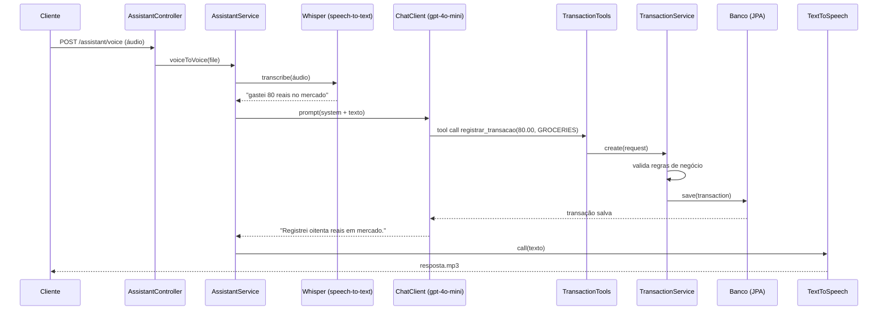
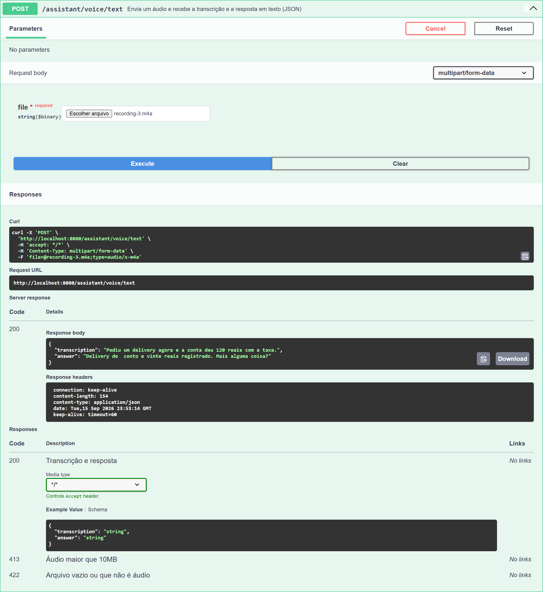
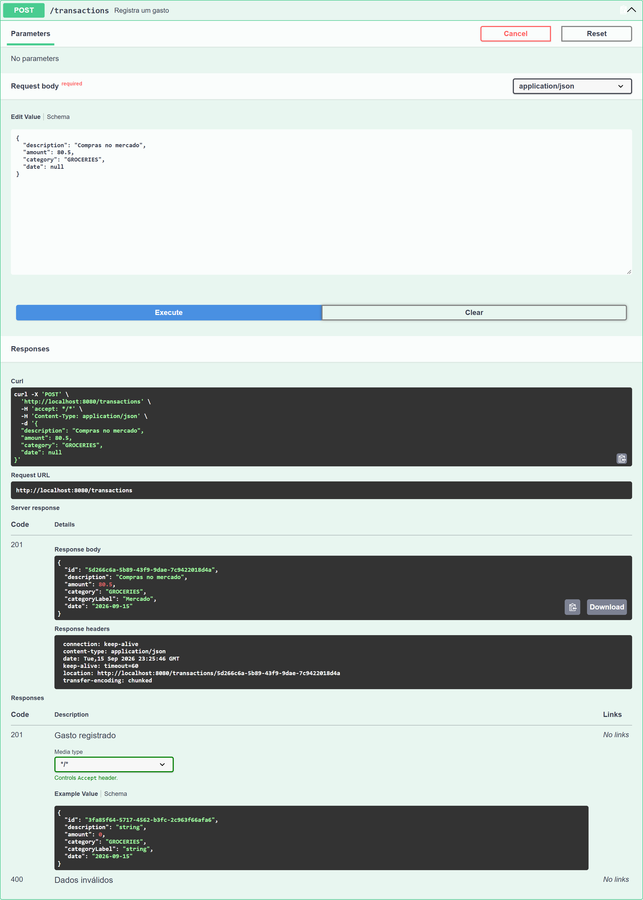
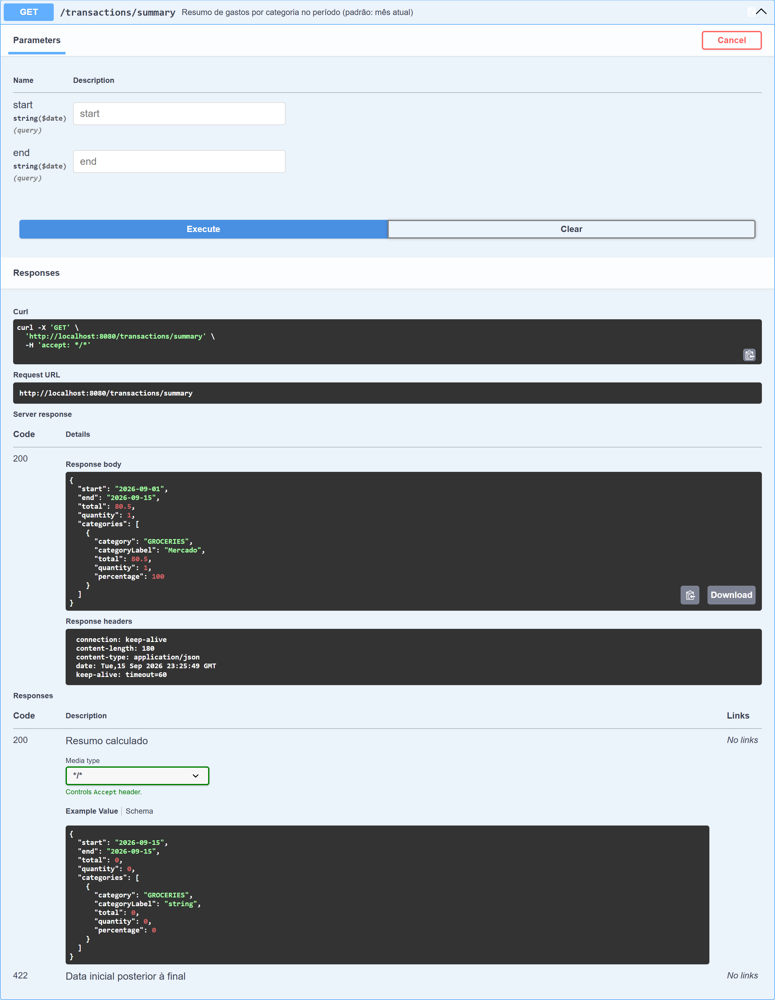

<div align="center">

# 💰 Assistente de Orçamento com Spring AI

**Fale quanto gastou. A IA registra no banco e responde em áudio.**

[](https://openjdk.org/projects/jdk/25/)
[](https://spring.io/projects/spring-boot)
[](https://docs.spring.io/spring-ai/reference/)
[](https://maven.apache.org/)
[](https://platform.openai.com/docs/models)
[](https://console.groq.com/)

[](https://www.mysql.com/)
[](https://www.h2database.com/)
[](https://springdoc.org/)
[](#-testes-automatizados)
[](https://www.dio.me/)
[](LICENSE)

[](https://github.com/BrunoBergamin/desafio-dio-spring-ai-budgeting/commits/main)
[](https://github.com/BrunoBergamin/desafio-dio-spring-ai-budgeting)
[](https://github.com/BrunoBergamin/desafio-dio-spring-ai-budgeting)

[Fluxo](#-fluxo-principal) · [Prints](#-a-api-rodando) · [Arquitetura](#️-arquitetura-em-camadas) · [Melhorias](#-melhorias-que-implementei) · [Como executar](#️-como-executar) · [Como testar](#-como-testar-o-fluxo-principal) · [O que aprendi](#-o-que-aprendi)

</div>

---

API REST de controle de gastos em que você **fala** o que gastou ("gastei 80 reais no mercado") e a IA registra a transação no banco e responde **em áudio**. Também dá para perguntar ("quanto gastei este mês?") e receber um resumo por categoria.

```
🎙️  "Gastei 80 reais no mercado"  →  🤖 Whisper + gpt-4o-mini + Tool Calling  →  💾 banco
                                                                              →  🔊 "Registrei oitenta reais em mercado."
```

Projeto desenvolvido no **Desafio de Projeto DIO + Itaú**, evoluindo o projeto final do módulo [05-spring-ai](https://github.com/digitalinnovationone/dio-spring-boot-learning-track/tree/main/05-spring-ai) do expert Poiani.

---

## ✅ O que a entrega cobre

| O que o desafio pede | Resposta curta | Onde ver |
|---|---|---|
| **O que o projeto faz** | Recebe um comando de voz ou texto sobre gastos, a IA entende a intenção, executa uma função real da aplicação e responde em linguagem natural (em áudio, no perfil OpenAI). | [Fluxo](#-fluxo-principal) |
| **Como executar** | `./mvnw spring-boot:run`, com a chave no `.env`. Roda sem Docker (H2 em memória). | [Como executar](#️-como-executar) |
| **Qual melhoria implementei** | 14 melhorias sobre o projeto base, com destaque para validações que valem também no caminho da IA, novas consultas e ferramentas, correção do bug de centavos e um perfil gratuito de execução. | [Melhorias](#-melhorias-que-implementei) |
| **Tecnologias** | Java 25, Spring Boot 4.1, Spring AI 2.0, Maven, JPA, H2/MySQL, Swagger, JUnit 5. | [Tecnologias](#️-tecnologias) |
| **Como testar o fluxo principal** | Um comando `curl` ou o Swagger UI, com áudios de exemplo já no repositório. | [Como testar](#-como-testar-o-fluxo-principal) |
| **O que aprendi** | Oito lições, incluindo um bug ainda aberto do Spring AI que precisei contornar. | [O que aprendi](#-o-que-aprendi) |

> **Rodei de verdade, sem pagar nada.** Usei a camada gratuita da [Groq](https://console.groq.com) (API compatível com a da OpenAI) para percorrer o fluxo inteiro: áudio → transcrição → Tool Calling → banco → resposta. Os prints e os exemplos deste README são respostas reais da aplicação, não exemplos inventados.

---

## 🔄 Fluxo principal



1. O cliente envia um arquivo de áudio.
2. O áudio vira texto (`TranscriptionModel` / Whisper).
3. O `ChatClient` entende a intenção e escolhe uma **ferramenta** (Tool Calling).
4. A ferramenta chama o `TransactionService`, que valida e persiste/consulta pelo `TransactionRepository`.
5. A IA gera a resposta final em texto.
6. O texto vira áudio MP3 (`TextToSpeechModel`).

---

## 📸 A API rodando

Documentação interativa em `http://localhost:8080/swagger-ui.html`, com os endpoints separados entre o assistente de IA e as transações:


O fluxo principal do desafio, com **resposta real da IA**: o áudio foi transcrito, o modelo escolheu a ferramenta, a transação foi gravada no banco e a resposta voltou em linguagem natural.



<details>
<summary><b>POST /transactions — registrando um gasto (clique para ver)</b></summary>

Resposta `201 Created` com o header `Location` apontando para o recurso criado:



</details>

<details>
<summary><b>GET /transactions/summary — resumo por categoria (clique para ver)</b></summary>

Total do mês, quantidade de lançamentos e o percentual de cada categoria:



</details>

---

## 🏗️ Arquitetura em camadas

```
src/main/java/dio/budgeting
├── controller/     → recebe HTTP, valida entrada (@Valid) e devolve DTOs
│   ├── TransactionController   (CRUD + consultas)
│   └── AssistantController     (texto e voz)
├── service/        → regras de negócio e orquestração
│   ├── TransactionService      (validação, cálculo do resumo)
│   └── AssistantService        (áudio → IA → áudio)
├── tool/           → adaptador entre a IA e o service (@Tool)
│   └── TransactionTools
├── repository/     → acesso a dados (Spring Data JPA)
│   ├── TransactionRepository
│   └── CategoryTotal           (projeção da consulta agregada)
├── entity/         → modelo persistido
│   ├── Transaction
│   └── Category (enum)
├── dto/
│   ├── request/    → TransactionRequest, ChatRequest
│   └── response/   → TransactionResponse, SpendingSummaryResponse, CategorySummaryResponse, AssistantResponse
├── mapper/         → converte Entity ⇄ DTO
├── exception/      → exceções de negócio + GlobalExceptionHandler (ProblemDetail)
└── config/         → ChatClient (tools registradas) e OpenAPI/Swagger
```

**Regra que segui:** o controller não conhece o repository, a entity não sai da API (sempre DTO), e a IA nunca toca no banco diretamente: ela só chama `TransactionTools`, que delega para o mesmo `TransactionService` usado pelos endpoints REST. Assim, **REST e IA passam pelas mesmas regras de negócio**.

---

## 🚀 Melhorias que implementei

| # | Melhoria | Onde |
|---|----------|------|
| 1 | **Reorganização em camadas clássicas** (controller, service, repository, entity, dto, mapper, exception, config, tool). O `ChatClient` saiu do construtor do controller e foi para `ChatClientConfig`; o fluxo de IA saiu do controller e foi para `AssistantService`. | todo o projeto |
| 2 | **Validações antes de salvar**: valor > 0 e ≤ 100.000, no máximo 2 casas decimais, descrição obrigatória (até 120 caracteres), categoria obrigatória, data não pode ser futura. As regras ficam nas anotações do DTO e o **service reaplica o mesmo `Validator`**, porque quando a IA chama a ferramenta a requisição não passa pelo `@Valid` do controller. | `TransactionRequest`, `TransactionService#validate` |
| 3 | **Correção de valor monetário**: o projeto base guardava centavos em `long`, mas a saída não dividia por 100 (80 reais apareciam como 8000.0). Troquei por `BigDecimal` em reais com 2 casas. | `Transaction`, `TransactionRequest` |
| 4 | **Novas consultas financeiras**: listagem com filtro opcional de categoria e período, e **resumo de gastos** com total, quantidade e percentual por categoria (padrão: mês atual). | `GET /transactions`, `GET /transactions/summary` |
| 5 | **Novas ferramentas para Tool Calling**: `registrar_transacao` (agora com data), `listar_transacoes`, `ultimas_transacoes` e `resumo_de_gastos`. | `TransactionTools` |
| 6 | **Respostas da IA melhores**: o system prompt recebe a **data de hoje** (para entender "ontem", "este mês"), proíbe inventar valores, pede o valor quando ele não foi dito e gera frases curtas e sem markdown, próprias para virar áudio. Mais categorias: restaurante, transporte, moradia, lazer, educação, outros. | `prompts/system-message.st`, `Category` |
| 7 | **Endpoints REST completos**: CRUD (`GET/PUT/DELETE /transactions/{id}`), `201 Created` com header `Location`, e erros padronizados com **ProblemDetail (RFC 9457)**: 400 com erros por campo, 404, 422 para regra de negócio, 413 para áudio grande. | `TransactionController`, `GlobalExceptionHandler` |
| 8 | **Endpoints de IA para testar sem ouvir áudio**: `POST /assistant/chat` (texto → texto) e `POST /assistant/voice/text` (áudio → transcrição + resposta em JSON), além do fluxo original áudio → MP3. Validação do arquivo enviado (vazio / não é áudio). | `AssistantController`, `AssistantService` |
| 9 | **Auditoria por log**: cada chamada de ferramenta, transcrição, pergunta e resposta da IA é registrada no log, e a entidade guarda `createdAt`/`updatedAt`. | `TransactionTools`, `AssistantService`, `Transaction` |
| 10 | **Testes automatizados** dos principais fluxos (27 testes sem custo + testes de ponta a ponta com a IA real). | `src/test` |
| 11 | **Roda sem Docker**: H2 em memória por padrão; MySQL continua disponível pelo perfil `mysql`. Documentação interativa com **Swagger UI**. | `application*.properties` |
| 12 | **Códigos de resposta documentados** no Swagger (201, 400, 404, 413, 422) com `@ApiResponse`, em vez do genérico "200 OK". | `TransactionController`, `AssistantController` |
| 13 | **Perfil gratuito alternativo (`groq`)**: a mesma aplicação roda com a API da Groq, sem custo. Como a Groq não oferece geração de voz, o `TextToSpeechModel` virou opcional e a rota de áudio responde `503` com uma mensagem clara, em vez de quebrar. | `application-groq.properties`, `AssistantService` |
| 14 | **Contorno de um bug aberto do Spring AI**: com modelos de raciocínio da Groq, o Tool Calling quebrava na segunda chamada (`HTTP 400: property 'reasoning_content' is unsupported`). Resolvi desligando o raciocínio pela configuração, com o link da issue no arquivo. | `application-groq.properties` |

---

## 🛠️ Tecnologias

- **Java 25** (LTS mais recente)
- **Spring Boot 4.1** (Web, Validation, Data JPA)
- **Spring AI 2.0**: `ChatClient`, Tool Calling (`@Tool`), `TranscriptionModel` e `TextToSpeechModel`
  - **OpenAI** (perfil padrão): `gpt-4o-mini`, `whisper-1` e `gpt-4o-mini-tts`
  - **Groq** (perfil `groq`, gratuito): `openai/gpt-oss-120b` e `whisper-large-v3-turbo`
- **H2** (padrão) e **MySQL 9** via Docker Compose (perfil `mysql`)
- **Lombok**
- **springdoc-openapi** (Swagger UI)
- **JUnit 5, Mockito, MockMvc, @DataJpaTest, AssertJ**
- **Maven** (Maven Wrapper incluso, não precisa instalar)

---

## ▶️ Como executar

### Pré-requisitos
- JDK 25 (com `JAVA_HOME` apontando para ele)
- Uma chave de IA, só para os endpoints `/assistant/**` (o CRUD funciona sem ela). São duas opções:
  - **Groq — gratuita**, em https://console.groq.com/keys. Faz tudo, menos a resposta falada em MP3.
  - **OpenAI — paga** (crédito mínimo de 5 dólares), em https://platform.openai.com/api-keys. Fluxo completo, incluindo o áudio de resposta.

### 1. Informe a chave

Copie o arquivo `.env.example` para `.env` na raiz do projeto e preencha a chave que você tiver:

```properties
GROQ_API_KEY=gsk_sua_chave_aqui
# ou
OPENAI_API_KEY=sk-sua_chave_aqui
```

O `.env` está no `.gitignore` e nunca vai para o GitHub. Se preferir, use variáveis de ambiente — elas têm prioridade sobre o arquivo:

```bash
export GROQ_API_KEY="gsk_..."        # PowerShell: $env:GROQ_API_KEY="gsk_..."
```

### 2. Suba a aplicação

```bash
./mvnw spring-boot:run          # Windows: .\mvnw.cmd spring-boot:run
```

Com a chave gratuita da Groq, use o **perfil `groq`**:
```bash
./mvnw spring-boot:run -Dspring-boot.run.profiles=groq
```
Ele usa `whisper-large-v3-turbo` para transcrever e `openai/gpt-oss-120b` para o Tool Calling. Funcionam `/assistant/chat` e `/assistant/voice/text`; a resposta falada em MP3 existe só no perfil padrão (OpenAI), porque a Groq não oferece text-to-speech gratuito — a rota `/assistant/voice` responde `503` explicando isso. **Nenhuma linha de código Java muda entre os dois perfis, só configuração.**

Com MySQL (precisa do Docker rodando, o Spring sobe o `compose.yml` sozinho):
```bash
./mvnw spring-boot:run -Dspring-boot.run.profiles=mysql
```

### 3. Acesse

| O quê | URL |
|------|-----|
| Swagger UI | http://localhost:8080/swagger-ui.html |
| Console H2 | http://localhost:8080/h2-console (JDBC URL `jdbc:h2:mem:budgeting`, usuário `sa`) |

---

## 🧪 Como testar o fluxo principal

O arquivo [`requests.http`](requests.http) tem todas as chamadas prontas para o IntelliJ ou VS Code. Com `curl`:

### Voz → voz (fluxo principal)
```bash
curl -X POST http://localhost:8080/assistant/voice \
  -F "file=@src/test/resources/audio/recording-1.m4a" \
  --output resposta.mp3
```
Abra o `resposta.mp3` para ouvir a confirmação.

### Voz → texto (para ver o que a IA entendeu)
```bash
curl -X POST http://localhost:8080/assistant/voice/text \
  -F "file=@src/test/resources/audio/recording-1.m4a"
```
Resposta real obtida com o áudio `recording-3.m4a` (o texto varia conforme o modelo):
```json
{
  "transcription": "Pediu um delivery agora e a conta deu 120 reais com a taxa.",
  "answer": "Delivery de cento e vinte reais registrado. Mais alguma coisa?"
}
```

### Texto → texto
```bash
curl -X POST http://localhost:8080/assistant/chat \
  -H "Content-Type: application/json" \
  -d '{"message": "Quanto eu gastei este mês e em qual categoria gastei mais?"}'
```

### REST direto (sem IA)
```bash
# criar
curl -i -X POST http://localhost:8080/transactions \
  -H "Content-Type: application/json" \
  -d '{"description":"Compras no mercado","amount":80.50,"category":"GROCERIES"}'

# resumo do mês
curl http://localhost:8080/transactions/summary
```

Exemplos de respostas reais obtidas rodando a aplicação:

```http
HTTP/1.1 201
Location: http://localhost:8080/transactions/c0905fed-9902-4793-9fb7-d8536e8964c7

{"id":"c0905fed-...","description":"Compras no mercado","amount":80.50,
 "category":"GROCERIES","categoryLabel":"Mercado","date":"2026-09-15"}
```

```json
// POST /transactions com {"description":"","amount":-5,"date":"2099-01-01"} → 400
{
  "title": "Dados inválidos",
  "status": 400,
  "detail": "Um ou mais campos estão inválidos",
  "errors": {
    "date": "a data não pode estar no futuro",
    "amount": "o valor deve ser maior que zero",
    "category": "a categoria é obrigatória",
    "description": "a descrição é obrigatória"
  }
}
```

```json
// GET /transactions/summary
{"start":"2026-09-01","end":"2026-09-15","total":80.50,"quantity":1,
 "categories":[{"category":"GROCERIES","categoryLabel":"Mercado","total":80.50,"quantity":1,"percentage":100.0}]}
```

### Endpoints

| Método | Rota | Descrição |
|-------|------|-----------|
| POST | `/transactions` | Registra um gasto |
| GET | `/transactions?category=&start=&end=` | Lista com filtros opcionais |
| GET | `/transactions/summary?start=&end=` | Total e percentual por categoria |
| GET | `/transactions/{id}` | Busca por id |
| PUT | `/transactions/{id}` | Atualiza |
| DELETE | `/transactions/{id}` | Remove |
| POST | `/assistant/chat` | Comando em texto |
| POST | `/assistant/voice/text` | Áudio → transcrição + resposta JSON |
| POST | `/assistant/voice` | Áudio → resposta MP3 |

Categorias: `GROCERIES`, `PHARMA`, `AUTO`, `RESTAURANT`, `TRANSPORT`, `HOUSING`, `LEISURE`, `EDUCATION`, `OTHER`.

---

## ✅ Testes automatizados

```bash
./mvnw test      # testes unitários, WebMvc e JPA (sem custo)
./mvnw verify    # também roda os testes *IT que chamam a IA de verdade (precisa de GROQ_API_KEY ou OPENAI_API_KEY)
```

| Classe | Tipo | O que garante |
|-------|------|---------------|
| `TransactionServiceTest` | Unitário (Mockito) | validações (valor negativo, data futura, campos vazios), 404, período invertido, cálculo de total e percentual |
| `TransactionControllerTest` | `@WebMvcTest` | 201 + Location, 400 com erros por campo, 404, 422, categoria inválida |
| `TransactionRepositoryTest` | `@DataJpaTest` (H2) | consulta agregada por categoria, filtros e ordenação |
| `TransactionToolsTest` | Unitário | as 4 ferramentas estão expostas ao modelo, conversão de datas, erro legível para a IA |
| `BudgetingApplicationTests` | `@SpringBootTest` | contexto sobe |
| `AssistantControllerTest` | `@WebMvcTest` | resposta do assistente, 400 para mensagem vazia, 422 para arquivo que não é áudio, 503 quando a voz está desligada |
| `AssistantFlowGroqIT` | Ponta a ponta (Groq, grátis) | mesmo fluxo no perfil sem custo, e a mensagem correta quando o MP3 não está disponível |
| `AssistantFlowIT` | Ponta a ponta (OpenAI real) | texto cria transação na categoria certa; sem valor **não** salva; áudio → banco → MP3 |

**Resultado local:** 27 testes passando sem custo nenhum, mais os 3 testes de ponta a ponta do `AssistantFlowGroqIT` executados de verdade contra a IA no plano gratuito da Groq — `BUILD SUCCESS` no `./mvnw verify`.

Cada teste de ponta a ponta só roda quando a sua chave existe (`AssistantFlowGroqIT` com `GROQ_API_KEY`, `AssistantFlowIT` com `OPENAI_API_KEY`). Assim ninguém é surpreendido por custo, e o build não falha em uma máquina sem chave.

---

## 📚 O que aprendi

- **IA não substitui organização de código.** No começo eu achava que a IA era o centro do projeto. Não é. Ela é só mais uma porta de entrada, igual a um endpoint REST. Quem manda continua sendo o service, e foi isso que me permitiu usar o mesmo código para o REST e para a IA.

- **A IA não passa pelo `@Valid`.** Essa foi a maior surpresa. Quando o modelo chama uma ferramenta, o controller nem é executado, então toda a validação que eu tinha feito no DTO era simplesmente pulada. Se eu não tivesse validado também no service, a IA conseguiria salvar um gasto de valor negativo.

- **Dar erro pode ser bom.** Quando a ferramenta lança uma exceção com uma mensagem clara, o Spring AI entrega essa mensagem para o modelo, e ele explica o problema para a pessoa em português. O erro vira conversa, não tela quebrada.

- **O prompt faz muita diferença.** Só de avisar a data de hoje, proibir inventar valores e pedir frases curtas, as respostas melhoraram bastante. Antes ela chutava valor quando eu não falava o preço; depois passou a perguntar.

- **Dinheiro se guarda em `BigDecimal`.** O projeto base guardava centavos e mostrava 80 reais como 8000.0. Achar esse bug me ensinou mais do que ler sobre o assunto.

- **Trocar de provedor de IA foi só configuração.** Quando vi que a OpenAI era paga, apontei o projeto para a Groq, que é gratuita, e funcionou sem mudar uma linha de Java. Isso só deu certo porque a IA estava isolada em um service e em uma classe de ferramentas.

- **Biblioteca nova tem bug, e isso é normal.** Meu Tool Calling quebrava com um erro estranho na Groq. Achei a causa lendo o log inteiro e descobri que era um bug do próprio Spring AI, ainda aberto no GitHub ([issue #6968](https://github.com/spring-projects/spring-ai/issues/6968)). Contornei por configuração. Antes eu assumia que o erro era sempre meu.

- **Dá para testar IA sem gastar dinheiro.** Quase tudo (service, controller, repository e ferramentas) eu testei com mock, sem chamar a IA. Só o teste de ponta a ponta precisa de chave, e ele se desliga sozinho quando a chave não existe.

---

## 🔗 Referências

- [Trilha Spring Boot DIO](https://github.com/digitalinnovationone/dio-spring-boot-learning-track)
- [Spring AI Reference](https://docs.spring.io/spring-ai/reference/index.html) · [ChatClient](https://docs.spring.io/spring-ai/reference/api/chatclient.html) · [Tools](https://docs.spring.io/spring-ai/reference/api/tools.html) · [Transcription](https://docs.spring.io/spring-ai/reference/api/audio/transcriptions.html) · [Speech](https://docs.spring.io/spring-ai/reference/api/audio/speech.html)
- [RFC 9457 – Problem Details](https://www.rfc-editor.org/rfc/rfc9457)
