<div align="center">

# 💰 Controle Financeiro

### Conheça a **Lumi**, uma assistente de gastos por voz

**Você fala quanto gastou. A Lumi registra no banco, confere o seu orçamento e responde.**

[](https://github.com/BrunoBergamin/desafio-dio-spring-ai-budgeting/actions/workflows/ci.yml)
[](https://openjdk.org/projects/jdk/25/)
[](https://spring.io/projects/spring-boot)
[](https://docs.spring.io/spring-ai/reference/)
[](https://spring.io/projects/spring-security)
[](https://react.dev/)

[](https://maven.apache.org/)
[](https://flywaydb.org/)
[](#-rodando-com-um-comando-docker)
[](https://console.groq.com/)
[](https://platform.openai.com/docs/models)
[](https://www.mysql.com/)
[](https://www.h2database.com/)
[](https://springdoc.org/)
[](#-testes-automatizados)
[-success?style=flat-square)](#-testes-automatizados)
[](https://www.dio.me/)
[](LICENSE)

[Rodar com Docker](#-rodando-com-um-comando-docker) · [Publicar de graça](#️-colocando-no-ar-de-graça) · [WhatsApp](#-falando-com-a-lumi-pelo-whatsapp) · [Prints](#-a-aplicação-rodando) · [Fluxo](#-fluxo-principal) · [Arquitetura](#️-arquitetura) · [Decisões](#-decisões-que-tomei) · [Melhorias](#-o-que-evoluí-sobre-o-projeto-base) · [Rodar sem Docker](#️-rodando-sem-docker) · [Endpoints](#endpoints) · [Testes](#-testes-automatizados) · [Como usei IA](#-como-usei-ia-para-construir-o-projeto) · [O que aprendi](#-o-que-aprendi)

</div>

---

## Sobre este projeto

Este é o meu projeto para o **Desafio de Projeto com Spring AI da DIO + Itaú**. A base é o projeto final do módulo [05-spring-ai](https://github.com/digitalinnovationone/dio-spring-boot-learning-track/tree/main/05-spring-ai) do expert Poiani: uma API que recebe um áudio, transcreve, usa IA para entender o que a pessoa quer, executa uma função real e responde.

Eu não sou expert em Spring nem em IA. Estou aprendendo, e este projeto foi feito com muita ajuda de IA generativa (explico exatamente como na seção [Como usei IA](#-como-usei-ia-para-construir-o-projeto)). O que eu tentei fazer foi entender cada parte, testar tudo de verdade (com a minha voz, no meu WhatsApp, no meu celular) e deixar o projeto completo e funcionando, não só o básico.

**O que ele faz:** você fala ou escreve o que gastou ("gastei 80 reais no mercado") e a **Lumi**, a assistente, entende, registra no banco, confere o seu orçamento do mês e responde em português. O que entra também conta: "recebi 5200 de salário" vira receita, e o painel mostra o saldo do mês. Dá para perguntar ("quanto gastei este mês?", "sobrou quanto?", "e o de ontem?"), definir limites ("meu limite de mercado é 800") e pedir ideias de economia. Funciona pelo site (no computador ou no celular) e pelo WhatsApp, mandando mensagem para você mesmo.

```
🎙️  você: "Gastei 85 reais no mercado hoje"
     ↓  transcrição (Whisper)
🤖  Lumi escolhe a ferramenta registrar_transacao  →  💾 banco  →  🎯 confere o orçamento
     ↓
💬  Lumi: "Gasto registrado: oitenta e cinco reais no mercado hoje. Atenção, você já usou
           oitenta e cinco por cento do limite de mercado neste mês, restam quinze reais."
```

> **Custo para rodar: zero.** A IA (chat e transcrição) usa o plano gratuito da [Groq](https://console.groq.com), que tem um limite diário de requisições mais do que suficiente para uso pessoal e não pede cartão. O WhatsApp usa a [Evolution API](https://github.com/EvolutionAPI/evolution-api), open source, que roda no seu computador dentro do `docker compose`. Banco (H2 ou MySQL), Docker e GitHub Actions: tudo gratuito. A única coisa paga é opcional: a resposta em áudio (text-to-speech) do perfil OpenAI, e a aplicação desliga isso sozinha quando não tem a chave.

> Os prints e as respostas deste README são reais, tirados da aplicação rodando aqui. Nada foi inventado.

---

## ✅ O que a entrega cobre

| O que o desafio pede | Resposta curta | Onde ver |
|---|---|---|
| **O que o projeto faz** | Recebe voz ou texto; a Lumi entende a intenção, executa uma função real (Tool Calling), grava ou consulta no banco e responde. | [Fluxo](#-fluxo-principal) |
| **Como executar** | `docker compose up --build` (um comando) ou `./mvnw spring-boot:run`. | [Rodar](#-rodando-com-um-comando-docker) |
| **Qual melhoria implementei** | 33 evoluções sobre o projeto base, da validação no caminho da IA até WhatsApp, receitas e saldo, contas recorrentes, metas, relatório e cookie `HttpOnly`. | [Melhorias](#-o-que-evoluí-sobre-o-projeto-base) |
| **Tecnologias** | Java 25, Spring Boot 4.1, Spring AI 2.0, Spring Security 7, JPA + Flyway, React 19, Docker, GitHub Actions. | [Tecnologias](#️-tecnologias) |
| **Como testar o fluxo principal** | Pelo navegador (microfone), pelo WhatsApp, pelo Swagger ou por `curl`, com áudios de exemplo no repositório. | [Como testar](#-como-testar-o-fluxo-principal) |
| **O que aprendi** | Dezessete coisas, incluindo dois bugs de biblioteca que precisei contornar. | [O que aprendi](#-o-que-aprendi) |

---

## 🐳 Rodando com um comando (Docker)

Precisa só do [Docker](https://www.docker.com/products/docker-desktop/). Não precisa de Java, Maven nem Node: tudo é compilado dentro da imagem. Sobem dois containers: a aplicação e um MySQL, com os dados guardados no volume `transaction_data`, então o que você registra continua lá depois de reiniciar.

```bash
git clone https://github.com/BrunoBergamin/desafio-dio-spring-ai-budgeting.git
cd desafio-dio-spring-ai-budgeting
cp .env.example .env        # preencha GROQ_API_KEY (grátis) e APP_JWT_SECRET
docker compose up --build
```

Abra **http://localhost:8080** e fale com a Lumi. **Não precisa criar conta nem senha**: o site entra sozinho na conta de demonstração, que já vem com dois meses de gastos fictícios e quatro orçamentos. O Swagger fica em `/swagger-ui.html` e o health check em `/actuator/health`.

**Modo demonstração (padrão).** A conta `demo@lumi.local` (senha fictícia `lumi-demo-1234`, só existe no seu computador) é criada na primeira subida com 30 lançamentos e 4 limites, e o frontend pega o token em `POST /api/auth/demo`. Quem for testar abre a URL e já vê o painel cheio. Para usar de verdade, com cadastro e login normais, coloque `APP_DEMO_ENABLED=false` no `.env`: o JWT, o multiusuário e o isolamento por usuário continuam funcionando, só ficam escondidos na demonstração.

- A chave da Groq é gratuita: crie em https://console.groq.com/keys (sem cartão).
- Quer começar do zero? `docker compose down -v` apaga o volume do banco e a conta demo é recriada na próxima subida.
- A hora "de hoje" é a de Brasília (`app.timezone`), e não a do container: um gasto registrado às 23h cai no dia certo.
- A imagem final roda como usuário sem privilégio (`lumi`), tem `HEALTHCHECK` e pesa cerca de 800 MB (JRE 25 + Ubuntu).

---

## ☁️ Colocando no ar de graça

O projeto roda inteiro na sua máquina com um comando, mas dá para publicar sem pagar nada. A imagem já é gerada e publicada pelo GitHub Actions em todo push na `main`, em `ghcr.io/brunobergamin/desafio-dio-spring-ai-budgeting:latest`, então o provedor só precisa puxar a imagem pronta.

O que é preciso ter (os dois com plano gratuito, sem cartão):

| Peça | Onde | O que o plano gratuito dá |
|------|------|---------------------------|
| Aplicação | [Koyeb](https://www.koyeb.com/) | 1 serviço, 512 MB, dorme depois de 1 h sem acesso |
| Banco | [Aiven para MySQL](https://aiven.io/free-mysql-database) | 1 GB de RAM e 1 GB de disco, sempre ligado |

No Koyeb, crie o serviço a partir da imagem do GHCR, porta 8080, health check em `/actuator/health`, e preencha as variáveis:

```bash
SPRING_PROFILES_ACTIVE=groq,mysql
GROQ_API_KEY=...                  # a mesma chave gratuita do .env
APP_JWT_SECRET=...                # openssl rand -base64 48
DB_URL=jdbc:mysql://HOST:PORT/defaultdb?sslMode=REQUIRED
DB_USER=avnadmin
DB_PASSWORD=...
APP_DEMO_ENABLED=true             # para quem abrir o link já ver o painel cheio
JAVA_OPTS=-XX:MaxRAMPercentage=60 -Xss512k -XX:TieredStopAtLevel=1 -XX:+UseSerialGC
```

Três coisas que aprendi preparando isso:

- **512 MB é apertado para a JVM.** Sem apertar as opções, o container morre na subida. O `JAVA_OPTS` acima deixa espaço para o resto do processo, e dá para conferir o consumo real em `/actuator/metrics/jvm.memory.used`.
- **O banco gerenciado exige TLS**, daí o `sslMode=REQUIRED` na URL. O perfil `mysql` já lê usuário, senha e URL de variáveis, então não precisa mexer em código.
- **O WhatsApp fica de fora do deploy.** A Evolution API precisaria de outro serviço e de um banco próprio, o que não cabe no plano gratuito. No computador ele continua funcionando com `--profile whatsapp`.

O primeiro acesso depois de um tempo parado demora, porque o serviço dorme e precisa subir de novo.

---

## 💬 Falando com a Lumi pelo WhatsApp

A mesma Lumi atende pelo WhatsApp: você manda um áudio ou um texto **para você mesmo** (o chat "Você") e ela registra o gasto, avisa do orçamento e responde ali. A integração usa a [Evolution API](https://github.com/EvolutionAPI/evolution-api) (perfil `whatsapp`), que roda junto no `docker compose`. A Evolution chama a aplicação pela rede interna do Docker, então não precisa de ngrok nem de servidor público.

```bash
# .env: SPRING_PROFILES_ACTIVE=groq,whatsapp  +  EVOLUTION_API_KEY  +  WHATSAPP_WEBHOOK_SECRET
docker compose --profile whatsapp up --build
```

1. Abra a página **WhatsApp** do site, clique em **Gerar QR code** e escaneie com o celular (WhatsApp → Aparelhos conectados).
2. No WhatsApp, abra o chat **"Você"** (mensagem para mim mesmo) e mande "gastei 30 reais na farmácia", em texto ou áudio. A Lumi responde ali mesmo.
3. No modo demo não precisa vincular nada: a primeira mensagem que você manda para si mesmo liga o número pareado à conta de demonstração. Com o modo demo desligado, vincule o número na própria página WhatsApp.

Foi pensado para o WhatsApp pessoal: a Lumi só age no chat com você mesmo. O que você manda para outras pessoas, e o que elas mandam para você, é ignorado. (Se você tiver um chip só para a Lumi, `WHATSAPP_REPLY_UNKNOWN=true` faz ela responder a desconhecidos com um convite para se cadastrar.)

Testei no meu próprio WhatsApp, só com áudio. Três notas de voz e três respostas: ela registrou os cinquenta reais da farmácia, resumiu o mês (dados fictícios da conta demo) e, quando pedi ideias de economia, usou os números reais das categorias em vez de dar um conselho genérico:

<p align="center">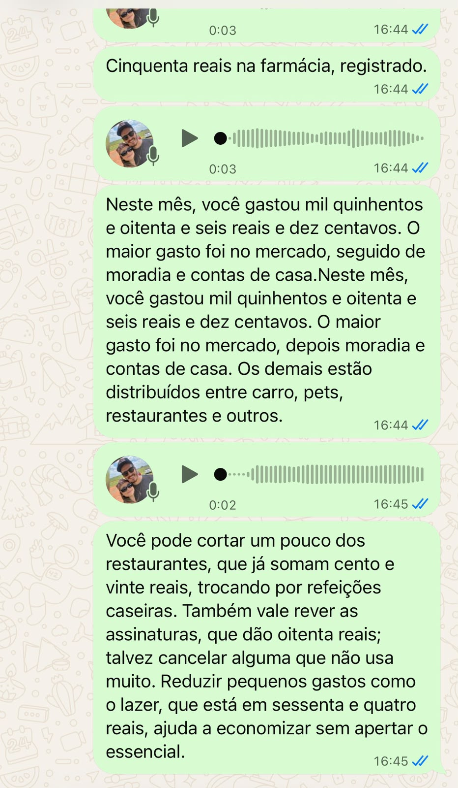</p>

<details>
<summary><b>Página WhatsApp do site: parear pelo QR code (clique para ver)</b></summary>

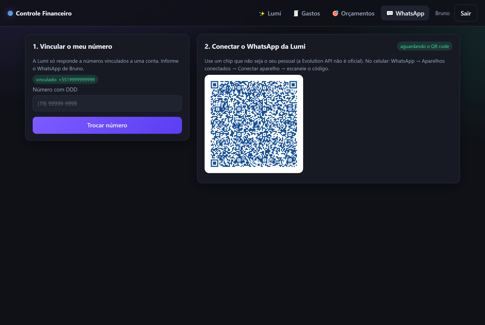

</details>

Como funciona por dentro: `POST /api/whatsapp/webhook/{segredo}` recebe o evento `messages.upsert`, responde `202` na hora e processa em segundo plano (`@Async`); o áudio chega em base64 (`ogg/opus`, que o Whisper aceita direto); o número vira o usuário pela coluna `users.phone`; a resposta volta por `POST /message/sendText` (e em áudio, no perfil OpenAI). No chat "Você" a própria resposta da Lumi volta pelo webhook como se fosse sua: a aplicação guarda os ids do que enviou e ignora o eco, senão ela conversaria consigo mesma para sempre. A conversa do WhatsApp tem memória separada da do site. O provedor fica atrás da interface `WhatsAppGateway`: para trocar a Evolution pela API oficial da Meta, é escrever outra implementação e mais nada.

> A Evolution não é a API oficial (usa o WhatsApp Web por baixo) e a Meta pode bloquear o número. Para estudo e demonstração ela resolve: grátis, local, sem cadastro de empresa. Para uso sério, a API oficial entraria no lugar.

---

## 📸 A aplicação rodando

**Painel**: gasto do mês com comparação ao mês anterior, maior categoria, orçamentos, gráfico por categoria e por dia, últimos lançamentos. Navegação por mês, tema escuro e claro.


**Conversa com a Lumi**: microfone, upload de arquivo de áudio (inclusive as notas de voz `.ogg` do WhatsApp, arrastando para a tela), histórico guardado no navegador, horário em cada mensagem. Abaixo, uma frase com dois gastos e uma nota de voz enviada como arquivo:

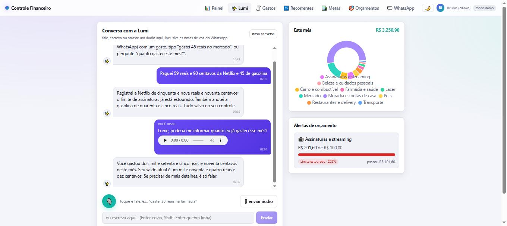

<details>
<summary><b>Tema escuro, celular, gastos e login (clique para ver)</b></summary>

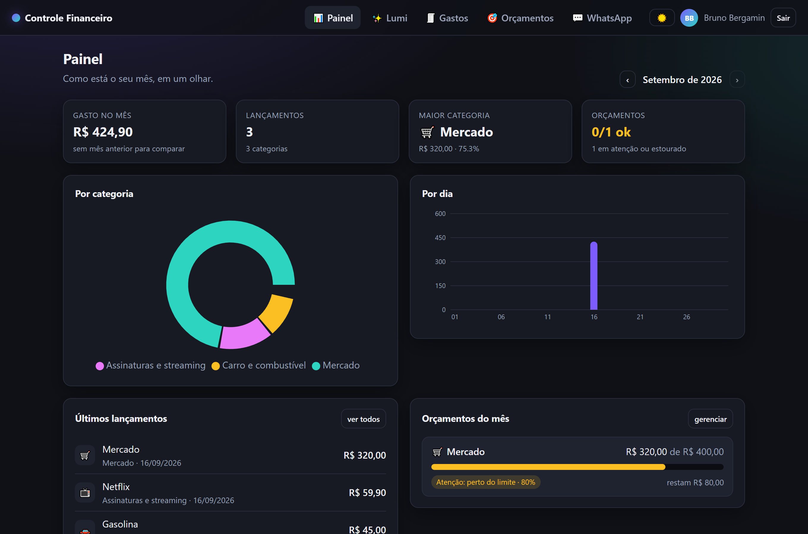
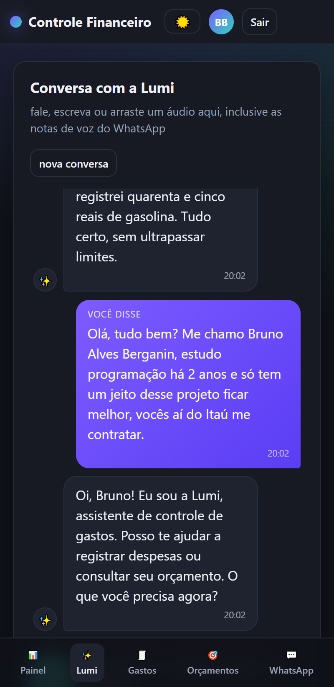
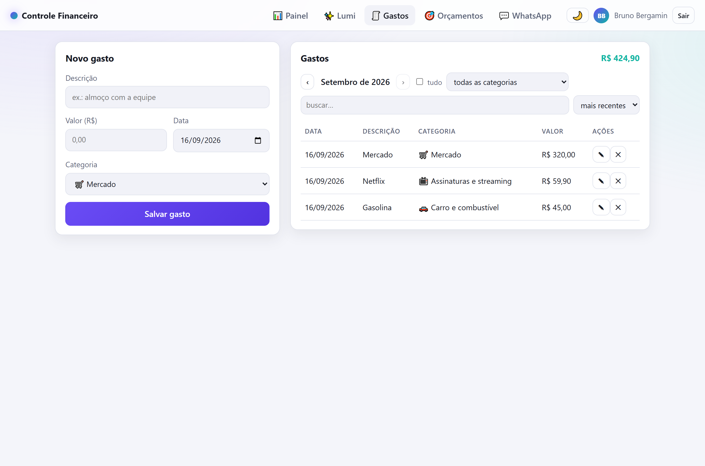
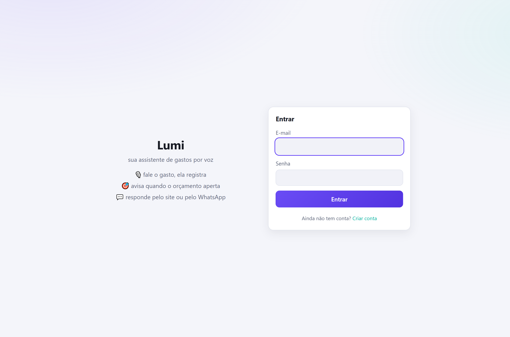

</details>

<details>
<summary><b>Gravando pela voz no navegador (clique para ver)</b></summary>

O botão do microfone usa `MediaRecorder` e grava em `webm/opus`, formato que o Whisper aceita. Abaixo, a transcrição da minha voz e a resposta com dados do banco:

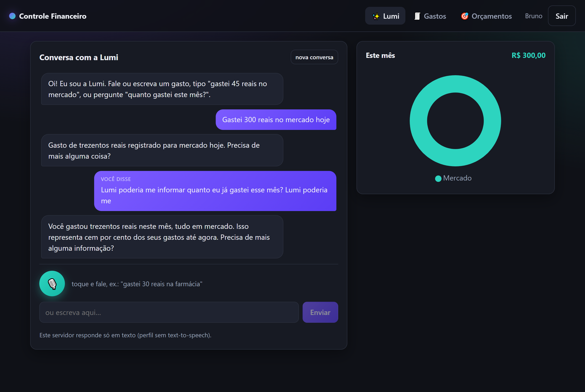

</details>

<details>
<summary><b>Swagger e os primeiros testes com a minha voz (clique para ver)</b></summary>

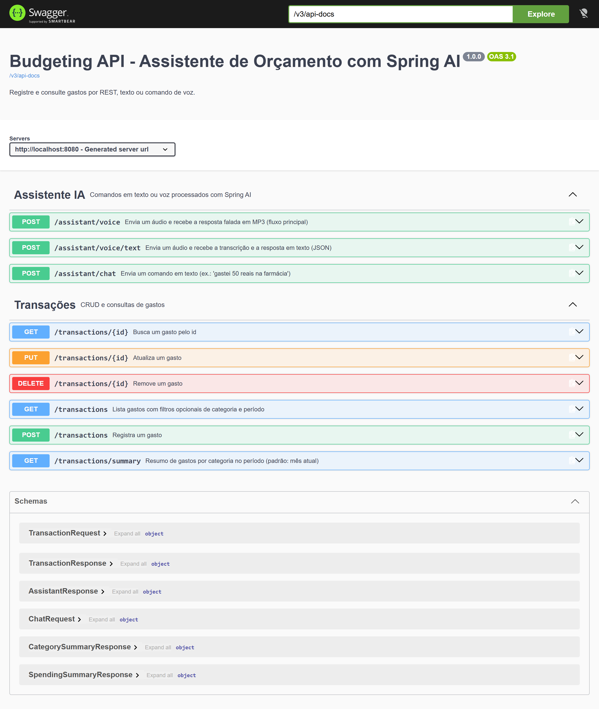

Os dois áudios estão em [`docs/audio`](docs/audio): me apresentando (ela entendeu que não havia gasto e não inventou nada) e perguntando o total do mês (ela buscou no banco em vez de chutar).

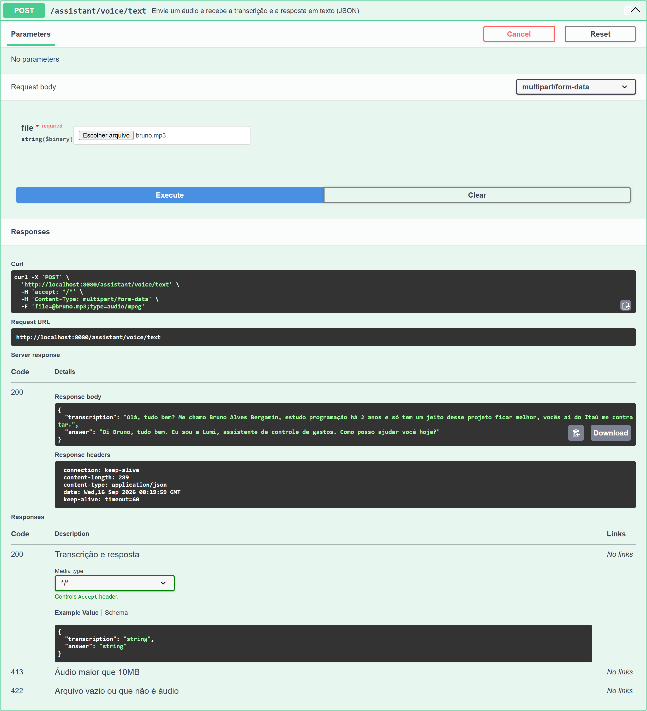


</details>

---

## 🔄 Fluxo principal

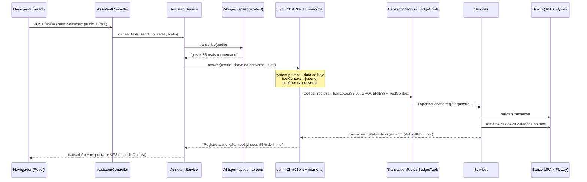

1. O navegador (ou o WhatsApp) manda o áudio.
2. O áudio vira texto (`TranscriptionModel`).
3. A Lumi (`ChatClient` com `MessageChatMemoryAdvisor`) entende a intenção e escolhe uma **ferramenta** (Tool Calling).
4. A ferramenta recebe o usuário pelo **`ToolContext`** (o modelo nunca vê nem escolhe o usuário) e chama o service.
5. O service valida, grava e confere o orçamento da categoria; o alerta volta no resultado da própria ferramenta.
6. A Lumi responde em uma frase curta; no perfil OpenAI, a frase vira MP3 (`TextToSpeechModel`).

---

## 🏗️ Arquitetura

Mantive a organização em camadas que aprendi na trilha: controller, service, repository, entity, dto, mapper, exception, config. A IA entra como mais uma porta de entrada, não como o centro.

```
src/main/java/dio/budgeting
├── controller/   AuthController, TransactionController, BudgetController, AssistantController, WhatsAppController  (prefixo /api)
├── service/      AuthService, TransactionService, BudgetService, ExpenseService, RecurringTransactionService,
│                 SavingsGoalService, ReportService, AssistantService, LumiChat, CsvExporter, ChatMemoryCleanup
├── tool/         TransactionTools, BudgetTools, ToolUser   (@Tool: a ponte entre a IA e os services)
├── whatsapp/     WhatsAppGateway (interface), EvolutionApiGateway, WhatsAppService, WhatsAppProperties
├── demo/         DemoProperties, DemoDataSeeder   (conta demo com dados fictícios)
├── security/     JwtService, CurrentUserProvider, AppUserDetailsService, ProblemDetailResponses
├── repository/   UserRepository, TransactionRepository, BudgetRepository  (toda consulta filtra por usuário)
├── entity/       User, Transaction, Budget, Category, BudgetStatus
├── dto/          request/ e response/ (a entity nunca sai da API)
├── mapper/       Entity ⇄ DTO
├── exception/    exceções de negócio + GlobalExceptionHandler (ProblemDetail / RFC 9457)
├── config/       SecurityConfig, JwtConfig, ChatClientConfig, OpenApiConfig, WebMvcConfig, WhatsAppConfig
└── web/          SpaForwardController (entrega o React nas rotas do site)

src/main/resources/db/migration   V1 transações · V2 usuários · V3 orçamentos · V4 telefone  (Flyway)
frontend/                          React 19 + Vite + TypeScript (gravação de voz, gráficos, orçamentos, WhatsApp)
.github/workflows/ci.yml           backend (mvnw verify) · frontend (tsc + build) · imagem Docker
```

A regra que segurei do começo ao fim: o controller não conhece o repository, a IA nunca toca no banco, e **o REST e a Lumi passam pelo mesmo service com as mesmas regras**. O `userId` é o primeiro parâmetro de todo método de service: se esquecer o usuário, não compila.

---

## 🧠 Decisões que tomei

Algumas coisas eu decidi com base no que estudei, outras descobri errando. Aqui estão as que mais mudaram o projeto.

**1. O usuário chega à ferramenta pelo `ToolContext`, não como parâmetro.**
Se o `userId` fosse um parâmetro da ferramenta, o modelo poderia "inventar" um id e ler os dados de outra pessoa. O Spring AI permite receber um `ToolContext` no método `@Tool` que **não entra no JSON Schema** enviado ao modelo, então a IA não vê e não consegue preencher o usuário. Tem um teste que manda um `userId` falso nos argumentos e prova que ele é ignorado (`TransactionToolsTest.should_ignoreUserIdSentByTheModel`). Além disso o repositório filtra por usuário e o `ToolUser.require` lança erro se o contexto vier vazio.

**2. A memória de conversa fica fora do loop de ferramentas.**
O `MessageChatMemoryAdvisor` roda antes do `ToolCallingAdvisor`, então o histórico guarda só o par pergunta/resposta e não as idas e vindas das ferramentas. Isso economiza tokens. A chave da memória é `userId:conversa`, montada a partir do JWT, então ninguém lê a conversa de outra pessoa. A memória fica no banco (`JdbcChatMemoryRepository`), com janela de 10 mensagens no prompt: a Lumi lembra do contexto mesmo depois de reiniciar, e um `@Scheduled` diário apaga o que passou de 30 dias.

**3. O alerta de orçamento não depende do modelo lembrar.**
Em vez de esperar a IA chamar uma segunda ferramenta, a própria `registrar_transacao` devolve a transação **e** o status do orçamento. O modelo recebe o alerta no resultado e comenta na resposta. Os limites (80% e 100%) são calculados com os valores exatos, não com o percentual arredondado: `399,99 de 500` ainda é OK. Um teste de fronteira achou esse bug.

**4. Nenhuma lista cresce sem limite, nem em RAM nem no banco.**
A listagem de gastos é paginada no banco (50 por página, teto de 500), então uma conta com anos de histórico não vira uma resposta gigante nem um `SELECT *`. A ferramenta `listar_transacoes` pede a primeira página já limitada em 50, em vez de trazer tudo e cortar na memória.

**5. Limite de requisições por minuto, sem dependência nova.**
Login, cadastro e demo são limitados por IP (10 por minuto), o que freia tentativa de adivinhar senha. As rotas da Lumi são limitadas por usuário (20 por minuto), porque cada chamada gasta cota gratuita da Groq: sem isso, um script esvazia a cota do dia em minutos. O contador é um `Caffeine` que expira sozinho depois de um minuto, e o teste avança um relógio falso em vez de esperar. Quem passa do limite recebe `429` no mesmo formato `ProblemDetail` do resto da API, com `Retry-After`.

**6. Memória da JVM com teto.**
Tudo que fica em RAM tem limite: conversas (200), mensagens por conversa (10), ids de mensagens enviadas ao WhatsApp (500), áudio de upload (10 MB), lista que a ferramenta devolve ao modelo (50 lançamentos; para totais existe `resumo_de_gastos`, que soma no banco). O webhook do WhatsApp roda em threads virtuais (Java 21+) com no máximo 8 em paralelo; o pool do banco tem 5 conexões; no Docker o container tem `mem_limit: 640m`, a JVM lê esse teto (`MaxRAMPercentage=75`) e cai e sobe de novo se estourar (`ExitOnOutOfMemoryError`). No navegador, os áudios da conversa são liberados com `URL.revokeObjectURL` ao sair da página. Medido: cerca de 400 MB em uso.

**7. Receita e gasto no mesmo lugar, sem um campo a mais para errar.**
Eu podia ter criado um campo `tipo` no formulário e na ferramenta, e validar que "salário" não fosse gasto. Preferi o contrário: a **categoria já sabe** o que ela é (`SALARY` é receita, `RESTAURANT` é gasto) e o tipo é derivado dela. Some um parâmetro que o modelo poderia preencher errado, some a validação cruzada e fica impossível gravar um lançamento incoerente. No banco a coluna `type` existe mesmo assim, porque filtrar por ela é muito mais barato do que listar as dezesseis categorias de gasto em cada consulta.

**8. Conta que se repete é uma regra, não um lembrete.**
A parte difícil de "todo dia 10 pago o aluguel" não é cadastrar, é não duplicar nem perder mês. Cada regra guarda o último mês já gerado, e o gerador percorre do mês seguinte a esse até hoje. Isso resolve os três casos com um laço só: a primeira vez, o dia que ainda não chegou (para e não grava nada) e o computador desligado por semanas (gera cada mês que passou, na data certa de cada um). Rodar duas vezes no mesmo dia não cria nada de novo, então ele roda todo dia às 00:05 e também quando a aplicação sobe. Dia 31 em fevereiro cai no último dia do mês, e pausar não faz a conta voltar cobrando os meses parados.

**9. Guardar dinheiro numa meta não é um gasto.**
A tentação era criar um lançamento na categoria "poupança" quando a pessoa guarda dinheiro. Isso estragaria tudo o que já existe: o total do mês subiria sem nada ter sido consumido, o orçamento seria comido por dinheiro que continua com você, e o saldo ficaria errado. O valor guardado mora na própria meta. Resumo, orçamento e saldo continuam falando só de dinheiro que entrou e saiu de verdade.

**10. O CSV tem detalhes que só aparecem testando no Excel.**
Exportar parecia trivial até abrir o arquivo. Sem o BOM no começo, o Excel em português lê como ANSI e "Farmácia" vira "Farmácia". Com vírgula como separador, o valor "80,50" quebra a linha em duas colunas, então o separador é ponto e vírgula. As linhas terminam em CRLF e a ordem é do mais antigo para o mais novo, porque planilha se lê de cima para baixo no tempo, ao contrário da tela. Tudo isso está em teste, inclusive os bytes do BOM.

**11. O token saiu do `localStorage` e foi para um cookie que o JavaScript não lê.**
Token no `localStorage` é confortável de programar e ruim de defender: qualquer XSS lê e leva. Agora o servidor manda o mesmo token num cookie `HttpOnly`, que o navegador guarda e reenvia sozinho. O front-end simplesmente não tem mais função de ler ou salvar token.

Duas decisões vieram junto. A primeira: quem procura o token olha o header `Authorization` primeiro e o cookie depois, então Swagger, `requests.http` e curl continuam funcionando como antes, e um teste no Swagger com outra conta não é atropelado pelo cookie do site aberto na outra aba. A segunda: mantive o CSRF desligado. Com `SameSite=Strict` o navegador não manda o cookie em nada que venha de outro site, inclusive formulário HTML, que é justamente o vetor que o CORS não cobre. Um token CSRF seria uma segunda defesa para a mesma ameaça, com mais peças para quebrar no webhook da Evolution e no Swagger.

**12. A memória da Lumi foi para o banco, e o limite mudou de natureza.**
Com a conversa em RAM, o risco era o heap: como o id da conversa vem do cliente, alguém poderia criar conversas sem parar, e por isso existia um limite de 200 conversas com descarte da mais antiga. No banco esse risco some e aparece outro: guardar conversa de um ano atrás não ajuda ninguém e é dado pessoal parado. Então o critério virou tempo, com uma limpeza diária do que passou de 30 dias.

A tabela é criada pelo Flyway, e não pelo Spring AI, por um motivo concreto: o script dele declara `conversation_id VARCHAR(36)` e a minha chave é `userId:conversa`, que passa disso. Também troquei o `ENUM` do script original por `VARCHAR`, porque `ENUM` só existe no MySQL e o mesmo SQL precisa rodar no H2 dos testes. As duas coisas estão cobertas por teste, inclusive no MySQL de verdade.

**13. A hora "de hoje" vem de um `Clock`, não do servidor.**
O container roda em UTC. Sem cuidado, um gasto registrado às 22h de Brasília cairia no dia seguinte, e no dia 30 o "resumo do mês" viraria o mês que vem. Existe um único bean `Clock` no fuso `America/Sao_Paulo` (`app.timezone`) e todo `LocalDate.now()` passa por ele. De quebra os testes de data ficaram determinísticos: o `TransactionServiceTest` fixa o relógio em 01:30 UTC e prova que o gasto cai no dia anterior, o de Brasília.

**14. Padrões que aparecem no código**, sem inventar camada nova: *Ports and Adapters* no WhatsApp (`WhatsAppGateway` é a porta, `EvolutionApiGateway` o adaptador); *Strategy* na memória de conversa (o `MessageWindowChatMemory` recebe o repositório pronto, e trocar RAM por banco não mexeu em mais nada); *Facade* no `AssistantService`, que esconde transcrição, chat e voz atrás de três métodos; *Command* no Tool Calling (cada `@Tool` é um comando que o modelo escolhe e o Spring AI executa); *Repository* e *DTO + Mapper* nas bordas; text-to-speech opcional com `ObjectProvider` + `Optional`, sem `if` de perfil espalhado; configuração por perfil (Groq, OpenAI, MySQL, WhatsApp) em vez de `if` no código.

**Outras:** `VARCHAR(36)` e `TIMESTAMP(6)` nas migrations para o mesmo SQL servir H2 e MySQL; JWT com o suporte nativo do Spring Security (`NimbusJwtEncoder`, HS256) em vez de biblioteca extra; 401 e 403 escritos como `ProblemDetail` por um `AuthenticationEntryPoint` próprio, porque exceções de segurança acontecem antes do `@RestControllerAdvice`; frontend empacotado dentro do jar para ter uma porta só, sem CORS e um container só; token num cookie `HttpOnly` com `SameSite=Strict`, fora do alcance do JavaScript; sem Kafka, porque para um app de gastos pessoais seria complexidade sem necessidade.

---

## 🚀 O que evoluí sobre o projeto base

| # | Melhoria | Onde |
|---|----------|------|
| 1 | **Reorganização em camadas clássicas** (controller, service, repository, entity, dto, mapper, exception, config, tool, security, web). | todo o projeto |
| 2 | **Validações antes de salvar** (valor, descrição, categoria, data futura), repetidas no service porque a ferramenta da IA não passa pelo `@Valid` do controller. | `TransactionService`, `BudgetService` |
| 3 | **Bug de centavos corrigido**: o base mostrava 80 reais como `8000.0`. Valores em `BigDecimal`. | `Transaction` |
| 4 | **Login e multiusuário com JWT** (Spring Security 7): cada pessoa só vê os próprios gastos; transação de outra pessoa responde 404, não 403. | `SecurityConfig`, `AuthService`, `JwtService` |
| 5 | **Usuário no Tool Calling via `ToolContext`**, com teste que tenta burlar. | `ToolUser`, `TransactionTools` |
| 6 | **Memória de conversa** no banco (`JdbcChatMemoryRepository` + `MessageWindowChatMemory`): "e o de ontem?" funciona e sobrevive ao restart; chave por usuário; `DELETE /api/assistant/conversation`. | `LumiChat`, `ConversationKey` |
| 7 | **Orçamento mensal por categoria com alertas** (OK / atenção / estourado) e 4 ferramentas novas para a Lumi. | `BudgetService`, `BudgetTools` |
| 8 | **Alerta entregue junto do registro do gasto**, sem ida e volta extra ao modelo. | `ExpenseService` |
| 9 | **Migrations com Flyway** (8 versões, SQL que serve H2 e MySQL) e `ddl-auto=validate`; os testes de repositório rodam sobre as migrations. | `db/migration`, `@JpaTest` |
| 10 | **Frontend React 19 + Vite + TypeScript**: painel com indicadores e dois gráficos, chat com microfone, upload e arrastar-e-soltar de áudio (aceita as notas de voz do WhatsApp), histórico, tema claro/escuro, notificações, edição inline, navegação por mês, layout de celular com menu inferior. React Query para cache, 10 testes com Vitest. | `frontend/`, `SpaForwardController` |
| 11 | **Docker em 3 estágios** (Node → Maven → JRE), usuário não-root, `HEALTHCHECK`, `compose` com MySQL persistente e Evolution opcional, imagem publicada no GHCR a cada push na `main`. | `Dockerfile`, `compose.yml`, `ci.yml` |
| 12 | **CI no GitHub Actions**: backend, frontend e imagem Docker, verde sem nenhum segredo. | `.github/workflows/ci.yml` |
| 13 | **Actuator** (`health`, `info`, `metrics`) e prefixo `/api` em todos os endpoints. | `WebMvcConfig`, `application.properties` |
| 14 | **Perfil gratuito (`groq`)**: mesma aplicação, só configuração; text-to-speech opcional (503 explicado). | `application-groq.properties` |
| 15 | **Contorno de um bug aberto do Spring AI** (`reasoning_content` reenviado à Groq, [issue #6968](https://github.com/spring-projects/spring-ai/issues/6968)). | `application-groq.properties` |
| 16 | **Conflito de versão do Swagger** (Spring AI × springdoc) resolvido no `pom.xml`, com o porquê comentado. | `pom.xml` |
| 17 | **Áudio em formato inesperado vira 422 explicado** (o Gravador do Windows salva AAC cru como `.m4a`). Descobri testando com a minha voz. | `AssistantService` |
| 18 | **Erros padronizados** com `ProblemDetail` em toda a API, inclusive 401/403 da camada de segurança. | `GlobalExceptionHandler`, `ProblemDetailResponses` |
| 19 | **System prompt** com data de hoje, proibição de inventar valores, memória e orçamento; persona "Lumi". | `prompts/system-message.st` |
| 20 | **236 testes** (unitários, `@WebMvcTest` com a segurança real, `@DataJpaTest` com Flyway, MySQL real com Testcontainers, ponta a ponta com IA) e cobertura com JaCoCo. | `src/test` |
| 21 | **WhatsApp via Evolution API** (perfil `whatsapp`): webhook protegido por segredo, chat "Você", áudio e texto, resposta em segundo plano, provedor atrás de interface. | `whatsapp/`, `WhatsAppController` |
| 22 | **20 categorias** (16 de gasto e 4 de receita) com um guia no schema da ferramenta para o modelo classificar melhor. | `Category` |
| 23 | **Modo demonstração**: conta pronta com dois meses de gastos e orçamentos, login automático sem senha, número do WhatsApp vinculado na primeira mensagem. `APP_DEMO_ENABLED=false` volta ao cadastro normal. | `demo/`, `AuthContext.tsx` |
| 24 | **Memória sob controle**: conversa guardada no banco com limpeza por tempo, threads virtuais com limite de paralelismo, listas paginadas, `mem_limit` no compose e JVM que respeita o container. | `ChatMemoryCleanup`, `application.properties`, `compose.yml` |
| 25 | **Receitas e saldo**: a categoria define se o lançamento é gasto ou receita, e o painel mostra quanto entrou, quanto saiu e o que sobrou. | `TransactionType`, `Category`, `DashboardPage.tsx` |
| 26 | **Contas recorrentes**: aluguel, streaming e salário lançados sozinhos todo mês, com acerto dos meses perdidos quando o app fica desligado. | `RecurringTransactionService`, `RecurringPage.tsx` |
| 27 | **Metas de economia** com prazo, progresso e quanto guardar por mês; guardar dinheiro não vira gasto. | `SavingsGoalService`, `GoalsPage.tsx` |
| 28 | **Exportar CSV** que abre certo no Excel em português e **relatório do mês** numa chamada só, que a Lumi sabe narrar. | `CsvExporter`, `ReportService` |
| 29 | **Token em cookie `HttpOnly`**, fora do alcance do JavaScript, sem perder o Bearer no Swagger e no curl. | `AuthCookies`, `CookieOrBearerTokenResolver` |
| 30 | **Paginação, limite de requisições por minuto e logs sem dado pessoal**; console do H2 só no perfil `dev`. | `PageResponse`, `RateLimitFilter` |
| 31 | **Fuso de Brasília em um `Clock` só**, então gasto às 23h cai no dia certo mesmo com o container em UTC. | `ClockConfig` |
| 32 | **MySQL como banco padrão** no Docker, com as migrations testadas num MySQL real (Testcontainers). | `compose.yml`, `MySqlMigrationsIT` |
| 33 | **Cobertura com JaCoCo, ESLint no CI e Dependabot**, além da imagem publicada no GHCR a cada push. | `pom.xml`, `ci.yml`, `dependabot.yml` |

---

## 🛠️ Tecnologias

- **Java 25** · **Spring Boot 4.1** (Web, Validation, Data JPA, Actuator, Security, OAuth2 Resource Server)
- **Spring AI 2.0**: `ChatClient`, Tool Calling (`@Tool` + `ToolContext`), `MessageChatMemoryAdvisor`, `TranscriptionModel`, `TextToSpeechModel`
  - **Groq** (perfil `groq`, gratuito): `openai/gpt-oss-120b` + `whisper-large-v3-turbo`
  - **OpenAI** (perfil padrão): `gpt-4o-mini` + `whisper-1` + `gpt-4o-mini-tts`
- **Evolution API** (WhatsApp, open source) · **Flyway 12** · **MySQL 9** (padrão no Docker) e **H2** (testes e modo rápido) · **Lombok** · **springdoc-openapi**
- **React 19**, **Vite 8**, **TypeScript**, `react-router`, `@tanstack/react-query`, `axios`, `recharts`, CSS puro com variáveis (tema claro/escuro)
- **Vitest + Testing Library** no frontend · **JUnit 5, Mockito, MockMvc, Spring Security Test, AssertJ** no backend
- **Maven** (wrapper) · **Docker** · **GitHub Actions**

---

## ▶️ Rodando sem Docker

Pré-requisitos: JDK 25 e (só para o frontend em modo dev) Node 22.

```bash
cp .env.example .env            # GROQ_API_KEY + APP_JWT_SECRET
./mvnw spring-boot:run -Dspring-boot.run.profiles=groq     # API em :8080 com H2 em memória (Windows: .\mvnw.cmd ...)
```

Com MySQL (dados persistentes), suba só o banco pelo Docker e aponte a API para ele:

```bash
docker compose up database                                        # MySQL em localhost:3307
./mvnw spring-boot:run -Dspring-boot.run.profiles=groq,mysql
```

Frontend com hot reload (o Vite faz proxy de `/api` para a API, sem CORS):

```bash
cd frontend && npm install && npm run dev                  # http://localhost:5173
```

Para servir o React pela própria API (como no Docker): `npm run build`, copie `frontend/dist` para `src/main/resources/static` e empacote com `./mvnw package`.

| O quê | URL |
|------|-----|
| Aplicação | http://localhost:8080 (ou :5173 em dev) |
| Swagger UI | http://localhost:8080/swagger-ui.html: botão **Authorize** com o token do `/api/auth/demo` (sem senha) ou do `/api/auth/login` |
| Health | http://localhost:8080/actuator/health |
| Console H2 | http://localhost:8080/h2-console (`jdbc:h2:mem:budgeting`, usuário `sa`) |

Perfil OpenAI (com resposta em MP3): defina `OPENAI_API_KEY` e rode sem `-Dspring-boot.run.profiles`.

---

## 🧪 Como testar o fluxo principal

**Pelo navegador (mais fácil):** abra http://localhost:8080 (já entra na conta demo), clique no microfone, fale *"gastei 45 reais na farmácia"* e veja a transação aparecer no gráfico. Depois pergunte *"quanto gastei este mês?"*.

**Pelo WhatsApp:** suba com o perfil `whatsapp`, pareie pelo QR code e mande um áudio para você mesmo.

**Pelo Swagger:** `POST /api/auth/demo` (ou `/register`) → copie o `token` → botão **Authorize** → `POST /api/assistant/voice/text` com um dos áudios de `src/test/resources/audio`.

**Por `curl`** (o arquivo [`requests.http`](requests.http) tem tudo pronto para o IntelliJ/VS Code):

```bash
# 1. token da conta demo (sem senha). Com APP_DEMO_ENABLED=false, use /api/auth/register
TOKEN=$(curl -s -X POST localhost:8080/api/auth/demo | jq -r .token)

# 2. limite do mês
curl -s -X POST localhost:8080/api/budgets -H "Authorization: Bearer $TOKEN" -H "Content-Type: application/json" \
  -d '{"category":"GROCERIES","monthlyLimit":100}'

# 3. voz -> texto (resposta real abaixo)
curl -s -X POST localhost:8080/api/assistant/voice/text -H "Authorization: Bearer $TOKEN" \
  -F "file=@src/test/resources/audio/recording-1.m4a"

# 4. voz -> MP3 (perfil OpenAI)
curl -s -X POST localhost:8080/api/assistant/voice -H "Authorization: Bearer $TOKEN" \
  -F "file=@src/test/resources/audio/recording-1.m4a" --output resposta.mp3
```

Resposta real do passo 3 (o texto varia conforme o modelo):
```json
{
  "transcription": "Passei na farmácia rapidinho e deixei 80 reais em 3 itens.",
  "answer": "Gasto de oitenta reais registrado na farmácia para hoje.",
  "conversationId": "default"
}
```

> Se gravar com o Gravador de Voz do Windows, o `.m4a` pode vir como AAC cru e a API responde `422` explicando. Converta com `ffmpeg -i gravacao.m4a gravacao.mp3`. Pelo navegador isso não acontece: o `MediaRecorder` grava em `webm`, aceito direto.

### Endpoints

| Método | Rota | Descrição |
|-------|------|-----------|
| POST | `/api/auth/demo` | Token da conta de demonstração, sem senha (público; 404 com o modo demo desligado) |
| POST | `/api/auth/register` · `/api/auth/login` | Conta e token JWT, no corpo e num cookie `HttpOnly` (público) |
| POST | `/api/auth/logout` | Apaga o cookie do token (público) |
| GET | `/api/auth/me` | Usuário autenticado |
| POST/GET | `/api/transactions` | Registra gasto ou receita · lista paginada (`?type=&category=&start=&end=&page=0&size=50`, teto de 500) |
| GET | `/api/transactions/export.csv` | Baixa os lançamentos do período em CSV (abre no Excel em português) |
| GET | `/api/reports/monthly` | Fechamento do mês: entrou, saiu, sobrou, maiores gastos, orçamentos e metas |
| GET | `/api/transactions/summary` | Gastos por categoria, total recebido e saldo (padrão: mês atual) |
| GET/PUT/DELETE | `/api/transactions/{id}` | Busca · atualiza · remove (só do próprio usuário) |
| POST/GET | `/api/budgets` | Define · lista limites do mês com quanto já foi gasto |
| GET | `/api/budgets/alerts` | Só as categorias em atenção ou estouradas |
| PUT/DELETE | `/api/budgets/{id}` | Altera limite · remove |
| POST/GET | `/api/recurring` | Cadastra · lista contas que se repetem todo mês, com a próxima data |
| PUT/DELETE | `/api/recurring/{id}` | Altera, pausa ou retoma (`active`) · remove (os lançamentos ficam) |
| POST/GET | `/api/goals` | Cria · lista metas de economia com o progresso |
| POST | `/api/goals/{id}/deposits` | Guarda dinheiro na meta (não é gasto) |
| PUT/DELETE | `/api/goals/{id}` | Altera nome, alvo, prazo ou valor guardado · remove |
| POST | `/api/assistant/chat` | Comando em texto (`conversationId` opcional) |
| POST | `/api/assistant/voice/text` | Áudio → transcrição + resposta JSON |
| POST | `/api/assistant/voice` | Áudio → resposta MP3 (503 no perfil groq) |
| DELETE | `/api/assistant/conversation` | Apaga o histórico da conversa |
| PUT | `/api/auth/me/phone` | Vincula o número do WhatsApp à conta |
| GET/POST | `/api/whatsapp/status` · `/api/whatsapp/connect` | Estado da conexão · QR code para parear (perfil `whatsapp`) |
| POST | `/api/whatsapp/webhook/{segredo}` | Chamado pela Evolution a cada mensagem (público, protegido pelo segredo) |

Categorias de gasto: `GROCERIES`, `RESTAURANT`, `PHARMA`, `HOUSING`, `TRANSPORT`, `AUTO`, `SUBSCRIPTIONS`, `CLOTHING`, `PERSONAL_CARE`, `LEISURE`, `EDUCATION`, `PETS`, `TRAVEL`, `GIFTS`, `TAXES`, `OTHER`. De receita: `SALARY`, `FREELANCE`, `INVESTMENTS`, `OTHER_INCOME`. Ferramentas que a Lumi conhece: `registrar_transacao`, `listar_transacoes`, `ultimas_transacoes`, `resumo_de_gastos`, `definir_orcamento`, `consultar_orcamentos`, `status_do_orcamento`, `alertas_de_orcamento`, `criar_recorrente`, `listar_recorrentes`, `criar_meta`, `guardar_na_meta`, `consultar_metas`, `relatorio_mensal`.

---

## ✅ Testes automatizados

```bash
./mvnw test      # 225 testes sem custo (unitários, WebMvc com a segurança real, JPA sobre as migrations)
./mvnw verify    # + 5 num MySQL real (Testcontainers, precisa do Docker) + 9 de ponta a ponta com a IA
                 #   (os de IA só rodam se GROQ_API_KEY ou OPENAI_API_KEY existir no ambiente)
```

| Classe | Tipo | O que garante |
|-------|------|---------------|
| `TransactionServiceTest`, `BudgetServiceTest`, `ExpenseServiceTest` | Unitário | validações, 404 para dado de outra pessoa, total/percentual, **fronteiras 80%/100% do orçamento**, alerta no registro, **saldo com receitas e saldo negativo**, categoria de receita recusada no orçamento, data certa no fuso de Brasília |
| `CookieOrBearerTokenResolverTest` | Unitário | header vence o cookie, cookie sozinho autentica, cookie vazio é ignorado, `Secure` só em https, `HttpOnly` e `SameSite=Strict` no cookie emitido |
| `AuthServiceTest`, `JwtServiceTest` | Unitário | cadastro, e-mail duplicado, credencial inválida → 401, login demo (e recusa com o modo desligado), token com `sub` = id, assinatura com outra chave falha |
| `AssistantServiceTest`, `LumiChatTest`, `ConversationKeyTest` | Unitário | conversa presa ao usuário, `userId` no `ToolContext`, resposta duplicada pelo modelo limpa, formatos de áudio, TTS desligado |
| `ChatMemoryPersistenceTest` | `@DataJpaTest` + Flyway | a tabela aceita a chave `uuid:conversa` (maior que o padrão do Spring AI) e a limpeza tira só o que passou da janela |
| `TransactionToolsTest`, `BudgetToolsTest`, `RecurringToolsTest` | Unitário | ferramentas expostas, **`userId` fora do schema**, `userId` falso do modelo ignorado, erro claro sem contexto |
| `CsvExporterTest`, `ReportServiceTest` | Unitário | bytes do BOM, separador e aspas no CSV, valor em vírgula, ordem crescente; variação positiva e negativa contra o mês anterior, sem variação quando não havia o que comparar, corte no top 3, contagem de orçamentos em alerta |
| `SavingsGoalServiceTest` | Unitário com relógio fixo | percentual nas fronteiras, depósito que conclui a meta, guardar mais que o alvo não deixa "faltando" negativo, baixar o valor desfaz a conclusão, meta vencida, quanto por mês até o prazo, nome repetido vira 422 |
| `RecurringTransactionServiceTest` | Unitário com relógio fixo | **dia 31 em fevereiro**, acerto de meses após dias sem ligar o app, rodar duas vezes não duplica, dia que ainda não chegou, mês final respeitado, pausar e retomar sem cobrar o período parado, uma regra com erro não derruba as outras |
| `AuthControllerTest`, `TransactionControllerTest`, `BudgetControllerTest`, `AssistantControllerTest` | `@WebMvcTest` + `SecurityConfig` real | 401 com `ProblemDetail`, 201/400/404/422/503, validação por campo |
| `WhatsAppServiceTest`, `WhatsAppControllerTest` | Unitário + `@WebMvcTest` | chat "Você" aceito e eco da própria resposta ignorado, mensagens para outras pessoas e grupos ignoradas, extrai número (inclusive com LID), vínculo automático da conta demo, áudio em base64 vai para o Whisper, segredo errado → 404 |
| `TransactionRepositoryTest`, `UserAndBudgetRepositoryTest`, `RecurringTransactionRepositoryTest` | `@DataJpaTest` + Flyway | isolamento por usuário nas queries, agregações, `UNIQUE` de e-mail e de orçamento, **apagar a conta fixa mantém o histórico** |
| `format.test.ts`, `BudgetBar.test.tsx`, `useChatHistory.test.tsx` (frontend, Vitest) | Componente / hook | intervalo do mês, dinheiro em pt-BR, edição inline do limite, histórico do chat por usuário sem vazar URLs de áudio |
| `MySqlMigrationsIT` (5) | Testcontainers, MySQL 9.6 real | as 8 migrations rodam no MySQL (não só no H2), agregação por categoria, **busca com filtros nulos** (`:type is null or ...`, que o H2 aceita e o MySQL poderia recusar), `UNIQUE` de e-mail e de orçamento; pulado sem Docker |
| `AssistantFlowGroqIT` (6) · `AssistantFlowIT` (3) | Ponta a ponta com IA real | grava na categoria certa, transcreve áudio, **usuário B não vê o total de A**, lembra a mensagem anterior, avisa do orçamento, MP3 |

Resultado local: **225 no backend + 13 no frontend** sem chave; **236** com a chave da Groq e o Docker ligado (`BUILD SUCCESS` no `./mvnw verify`). No CI os testes de IA são pulados por condição, não por erro; o de MySQL roda, porque o runner do GitHub tem Docker.

**Cobertura (JaCoCo).** O `./mvnw verify` gera `target/site/jacoco/index.html` e falha se a cobertura de linhas cair abaixo de 70%. A medição é só onde mora regra de negócio (`service`, `tool`, `security`, `mapper`, `whatsapp`): DTO, entidade e configuração são declarativos e só inflariam o número. Hoje está em **77%**, e a parte menos coberta é o cliente HTTP da Evolution, que precisaria de um servidor falso para valer a pena.

**Qualidade do frontend.** `npm run lint` (ESLint 9 com as regras de hooks do React) roda no CI antes do build. Ele achou coisas que o TypeScript não vê: um `ref` sendo escrito durante a renderização no chat e um `setState` dentro de efeito na página do WhatsApp, os dois já corrigidos.

**Dependências.** O Dependabot abre PR semanal para Maven, npm e GitHub Actions, agrupado por assunto para não virar enxurrada de PR.

---

## 🤝 Como usei IA para construir o projeto

O desafio sugere usar o DIO Agent como apoio. Eu usei IA generativa (Claude Code, da Anthropic) como par de programação o projeto inteiro, e prefiro deixar isso claro do que fingir que fiz tudo sozinho.

- **Frontend React:** foi escrito pela IA a partir do que eu pedi (páginas, gráficos, gravação pelo microfone, tema, layout de celular). Eu não domino React. O meu papel foi dizer o que cada tela precisava fazer, testar cada versão no navegador e no celular, apontar o que estava errado (o menu do celular no lugar errado, o nome do mês com letra maiúscula, travessões nos textos) e pedir os ajustes.
- **Backend Spring:** feito em conjunto. As ideias e as decisões foram minhas (manter as camadas da trilha, migrar para Java 25 e Maven, trocar a OpenAI paga pela Groq gratuita, não usar Kafka, JWT sem biblioteca extra, WhatsApp pelo chat "Você", modo demo sem senha, cuidar da memória). A IA escreveu boa parte do código e dos testes; eu revisei, rodei e cobrei quando algo não funcionava. Foi assim que apareceram o bug da Groq com o `reasoning_content`, o `.m4a` do Windows e a Lumi respondendo para um amigo meu em vez de para mim.
- **Ideias e documentação:** as evoluções foram discutidas com a IA (o que vale a pena, o que é enfeite), e este README foi escrito a quatro mãos e revisado por mim.

O que é meu de verdade: as escolhas, os testes com a minha voz e o meu WhatsApp, o entendimento de cada peça (consigo explicar o `ToolContext`, a ordem dos advisors e por que o alerta de orçamento não depende do modelo) e o que está na seção abaixo. Acho que é assim que vou trabalhar daqui para a frente: a IA acelera, eu decido e respondo pelo resultado.

---

## 📚 O que aprendi

- **A IA não é o centro do projeto.** Ela é mais uma porta de entrada, como um endpoint REST. Quem manda é o service. Foi isso que deixou o mesmo código servir para o REST, para a voz, para o site e para o WhatsApp.

- **A IA pula o `@Valid`.** Quando o modelo chama uma ferramenta, o controller não roda. Sem validar também no service, a IA conseguiria salvar um gasto negativo.

- **Nunca deixe o modelo escolher o usuário.** Se `userId` fosse parâmetro da ferramenta, bastava a IA "inventar" um id para ler dados de outra pessoa. O `ToolContext` resolve, e escrevi um teste que tenta exatamente isso.

- **Segurança acontece antes do controller.** Um 401 é decidido na cadeia de filtros, então o `@RestControllerAdvice` nunca via a exceção e o erro voltava vazio. Precisei de um `AuthenticationEntryPoint` próprio.

- **`@WebMvcTest` não carrega a sua `SecurityConfig`.** Ele carrega a cadeia padrão do Boot e todos os testes viram 401. Uma anotação composta que importa a configuração real resolveu.

- **Memória de conversa custa tokens.** Deixar a memória fora do loop de ferramentas (ordem dos advisors) evita reenviar as chamadas de tool a cada turno.

- **Erro bom é erro explicado.** Se a ferramenta lança uma mensagem clara, o Spring AI passa para o modelo, e ele explica em português para a pessoa.

- **O prompt muda tudo.** Data de hoje, "nunca invente valores" e "avise se o orçamento vier WARNING" fizeram a Lumi parar de chutar e começar a avisar.

- **Dinheiro é `BigDecimal`**, e **percentual arredondado não serve para decidir status**: `399,99 de 500` virava 80,0% e caía em "atenção". Um teste de fronteira achou isso.

- **SQL portátil tem limite.** `VARCHAR(36)` e `TIMESTAMP(6)` rodam em H2 e MySQL; `DATETIME` e "tornar coluna `NOT NULL`" não. Descobri testando as migrations no próprio build.

- **Biblioteca nova tem bug, e faz parte.** O Tool Calling na Groq quebrava por um bug aberto do Spring AI ([#6968](https://github.com/spring-projects/spring-ai/issues/6968)); o Swagger quebrava por um conflito de versões que o Maven resolve diferente do Gradle. Ler o log até o fim resolveu os dois.

- **CSS também tem armadilha.** O menu fixo do celular apareceu no topo em vez de no rodapé. Causa: `backdrop-filter` no cabeçalho vira referência para `position: fixed` dos filhos. Achei testando em tela de 400px.

- **WhatsApp é só mais uma porta.** Como a Lumi vive no service, atender pelo WhatsApp foi um webhook, um cliente HTTP e uma coluna de telefone. O núcleo não mudou. E o formato do WhatsApp (`ogg/opus`) é aceito pelo Whisper sem conversão.

- **Tudo que fica em RAM precisa de teto.** A memória de conversa do Spring AI limita mensagens por conversa, mas não o número de conversas, e o id vem do cliente. Um Decorator com LRU resolveu sem trocar a biblioteca. A mesma pergunta ("isso cresce para sempre?") valeu para o `@Async`, para a lista que a ferramenta manda ao modelo e para os áudios no navegador.

- **Para demonstrar, tire o atrito.** Ninguém quer criar conta para testar um projeto de estudo. O modo demo entra sozinho numa conta com dados, e o login de verdade continua a um `APP_DEMO_ENABLED=false` de distância.

- **IA como par exige revisão de verdade.** A IA escreve rápido e também erra rápido: o alerta de orçamento saiu errado no arredondamento, o modelo respondeu duas vezes na mesma mensagem do WhatsApp, o menu do celular ficou no topo. Só apareceu porque eu rodei e testei. Sem revisar, eu teria entregue bug com cara de pronto.

- **Testar com a minha própria voz achou bug.** O Gravador do Windows salva um `.m4a` que não é m4a; a API dava 500. Virou uma mensagem explicando o que fazer, e o frontend gravando em `webm` resolveu de vez.

---

## 🔭 Próximos passos

- **Conexão com o banco (Open Finance):** importar os lançamentos da conta e do cartão pela API do banco e deixar a Lumi só classificar e comentar. O `ExpenseService` já é o ponto único de entrada de um gasto, então a importação seria mais uma porta, como o WhatsApp foi.
- **API oficial do WhatsApp (Meta Cloud API):** outra implementação de `WhatsAppGateway`, sem mexer no resto.

---

## 🔗 Referências

- [Trilha Spring Boot DIO](https://github.com/digitalinnovationone/dio-spring-boot-learning-track)
- [Spring AI Reference](https://docs.spring.io/spring-ai/reference/index.html) · [ChatClient](https://docs.spring.io/spring-ai/reference/api/chatclient.html) · [Tools](https://docs.spring.io/spring-ai/reference/api/tools.html) · [Chat Memory](https://docs.spring.io/spring-ai/reference/api/chat-memory.html) · [Transcription](https://docs.spring.io/spring-ai/reference/api/audio/transcriptions.html) · [Speech](https://docs.spring.io/spring-ai/reference/api/audio/speech.html)
- [Spring Security, OAuth2 Resource Server (JWT)](https://docs.spring.io/spring-security/reference/servlet/oauth2/resource-server/jwt.html)
- [Flyway](https://documentation.red-gate.com/flyway) · [RFC 9457, Problem Details](https://www.rfc-editor.org/rfc/rfc9457)
- [Evolution API](https://doc.evolution-api.com/) · [MediaRecorder API](https://developer.mozilla.org/en-US/docs/Web/API/MediaRecorder)
- [Groq Console](https://console.groq.com/) · [OpenAI Platform](https://platform.openai.com/docs)

---

<div align="center">

Feito por **Bruno Bergamin** para o Desafio de Projeto DIO + Itaú, com Spring Boot, Spring AI e bastante teste na prática.

</div>
